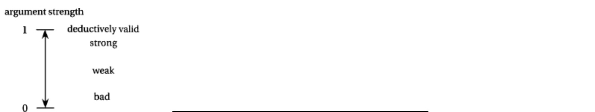
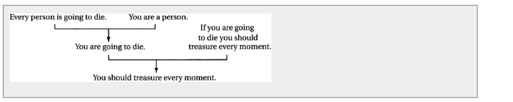
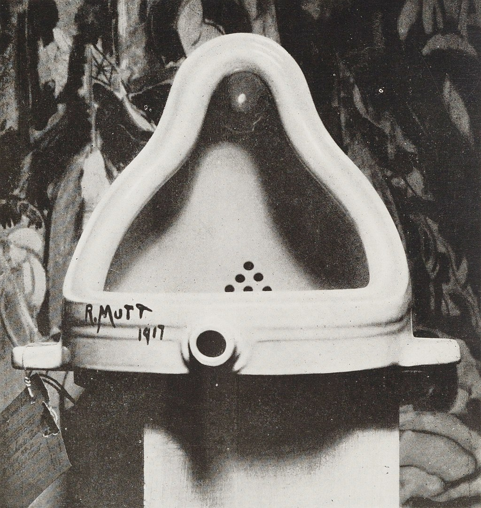

短短幾年辯手的生涯，曾經有幸接受過許多本校和非本校的學長辯論的教學和啟發。也許親自帶比賽還是傳承最好的辦法，但機會有限，只能退而求其次。希望透過解析一些辯論前輩的文章和部分自己的解讀可以給學弟妹學習辯論上一些啟發 by 陳翰揚

# 前言

辯論是什麼？

不同的對於這件事情的解釋，會生成不同對於「如何打辯論？」的不同作法。本系列文章，對於「辯論是什麼」的理解如下：

辯論是雙方各自為自己的持方尋找一套符合持方的理論架構，在自己的理論架構上勝過對方。

由於好的辯論比賽，雙方都在「論點」本身是對的；通常意義上，不是「論點」本身的優劣決定勝負，而是「理論架構」勝過對方。

所謂勝過對方的理論架構可以參考以下幾個角度：

(以下觀點擷取自 An Introduction to Critical Thinking and Creativity: Think More, Think Better)

A. 預測能力 predictive power 

一個好的理論應該能夠更精準的預測會發生的事情，甚至很多所謂「機器學習」、「人工智能」所訓練出來的模型只強調預測能力，而不在乎內在的機理。

在辯論場上，如果一方的「理論架構」可以解釋更多現實生活的例子，通常佔優。

B. 內在機理 Mechanism 

一個有辦法解釋內在機理的理論勝過無法解釋的理論。有些時候，兩件事情可能有強的正向關聯性，但卻無法有任何因果關係的解讀。這種理論很可能是錯把「相關」當「因果」。比如：冰淇淋的銷量帶來了更多的鯊魚咬人事件。

在辯論場上，如果一方的「內在機理」沒有被打穿，一方「內在機理」已經被證偎，或甚至根本不存在，有「內在機理」一方通常佔優。

C. 有料程度 Fruitfulness 

有料程度和此前兩點有相關聯，一個有料的理論應該能幫助我們做出「驚奇、沒有料到的」預測，或者幫助我們「偵測、解釋」我們原先無法察覺到的其他聯繫。例如：在地質科學中的板塊論，使得地質學家可以據此解釋為何地震往往發生在海溝或者擴張脊（由於漂浮的板塊互相擠壓），為何海洋動物化石可以在數千米的高山上找到（板塊互相推擠行成高山），為何南美洲和西非可以緊密的被拼在一起（兩者之前曾是同一塊大陸）

在辯論場上，如果一方觀點只是普通的觀點、沒什麼新意，另一方可以提出獨特的角度，創造性的解決某些爭端，「角度獨特一方」通常佔優。

D. 一致性 Coherence 

一個好理論需要有兩種一致性，內在的邏輯一致性和與其他有公信力的理論(well-established theory) 的相容性。

與常識相悖也是屬於和其他有公信力的理論不具有相容性的展現。辯論比賽中歸謬的手法因此可以大致分為對邏輯的歸謬和對和外在理論相容性的歸謬。

在辯論場上，如果一方與「反現實常識」、「自相矛盾」，通常「符合常識、自洽」的一方佔優。

E. 簡潔性 Simplicity 

一般而言，對理論的預設條件越少，一個理論越好。

在辯論場上，越簡潔的理論需要更少的證明，在其他條件類似的情況下，比起複雜的架構，更佔優。

在科學上，簡潔是否一定優於複雜是有爭議的話題。許多科學家相信如此，追求能夠整合四大基本力的大一統理論。但也有反對的聲音，認為世界有可能本身就是複雜而非簡潔的。

在好的辯論比賽中，雙方的理論架構不太會出現內在嚴重的邏輯（D）或者一方特別繁複的情況（E），更多情況下是在 預測能力 （A ）內在因果機制（B ）或者有料程度（ C） 層次的問題。

如果借用熊浩學長的分析，[你的辯論是否已入門](https://www.notion.so/hanyangchen/90a17b735e8a450b9e225e7aae65bb0f)：追求在預測能力A、內在機理B上勝過對方，更像是社會科學意義上的辯論， 追求獨特，提高理論架構的 有料程度C 則很大程度上是人文科學意義上的辯論。前者雙方激辯邏輯、統計方法、對現實的解釋力、因果關係是否牢靠，後者討論的是何者的觀點更能帶來新啟發、更能說服力。

> [你的辯論，是否已入門](https://www.notion.so/hanyangchen/90a17b735e8a450b9e225e7aae65bb0f)

1
影视作品应该翻拍，为何？
2
因为翻拍完成，老作品与时俱进；因为翻拍之后，观众们乐见喜闻——还有吗？——没有了，大致如此。
恩，如果大致如此，**这表明你还需要了解一点点社会科学的入门义理——关于什么是假说（Hypothesis），什么是论证（Argument）。**
3
张五常在《新卖桔者言》一书中，记录了一则经济学史上的经典掌故——灯塔的传奇。
从一八四八年开始的不同历史时期，经济学家英国的密尔、西奇威克、庇古，到当代美国的萨缪尔森，都对灯塔有过精巧的分析。借用灯塔，论说市场经济在特殊领域的无力。
简单说，海中的灯塔无法用市场机制让私人投资，而必须由政府公帑出力建造。理由很简单，灯塔虽然具有重要的实用价值，然无法向使用者收费——远远的航船若得见远处的微光，便知此路不通，需要绕行，使用者确实受益，然产权人鞭长莫及，故此等事，傻子也不会去做。我们扩大地理解，市场失灵之处，便是政府显灵之时——灯塔的建造，无法仰赖市场，只能公帑投资。
这个非常符合常理的解释似乎天衣无缝，但在一九七四年，这个完美的灯塔传奇遭遇了科斯。
科斯调查了英国早期的灯塔制度，发现在十七世纪，公帑修建的灯塔不过两个，但私人投资的灯塔却超过十家。之后私人灯塔的数量持续增长，直到一八四二年后，政府通过法例，要求领港工会将私营灯塔逐步收归公有，私人灯塔才退出了历史舞台。
更为有趣的是，政府在收购私营灯塔时的理由，不是因为他们收费困难，正好相反，是因为他们收费太高。这显然说明以往这些经济学家对灯塔的解释存在问题——嗯，**在社会科学的意义上，尚未被经验验证的论断，即使逻辑严密、入情入理，也只是假说，一个尚待检定的陈述罢了（Statement）。**
4
**明白这一点，你就清楚，太多辩论赛的立论不是论证，无非是大量假说的暴力堆积。**
我们还是以文章最开始的这个“论证”为例——为什么影视作品应该翻拍？因为翻拍之后，观众们喜闻乐见。其实发言者是在说：翻拍之后，那些观众们怀念的经典作品就“**有可能**”重新落入普罗大众的日用习常，那些他们“**有可能**”时时怀念银幕形象、经典对白、标志桥段就“**有可能**”重新被观众们忆起，从而让他们“**有可能**”快乐、欢欣、去追捧。
用心的人会听得到，这样一句斩钉截铁的陈述里其实包裹了多少“暗语”似的“有可能”，而每一处“有可能”都是一个待证命题，一处虚妄假设，一种勇敢猜想，这些“有可能”都需要测量、描述、检定，都需要证据与资料的加持。
社会科学的框架里大致两条路，要么扎根以田野为核心，以个案为特色，以深描为方法，以非随机抽样为底色的定性研究；要么通透以统计为工具，以抽样为主轴，以随机为义理，以回归分析为归宿的定量研究。没有这些方法而产生的资料支撑，别说好的论证了，你就连论证的门都还没有敲开。
你说，上面这段关于方法的叙述中有太多的“生词”从未听说，恩，那只能说明一件事：你辩论的积累，在社会科学的意义上，还没入门。
5
那可还有别的路子？
当然，教你一条下华山的后路，阐释之门。
6
我们先要建立一个大前提，即所有的影视叙述，都是“翻拍”。
以红楼为例。
《红楼梦》讲什么？
鲁迅先生说：“《红楼梦》是中国许多人所知道，至少，是知道这名目的书。谁是作者和续者姑且勿论，单是命意，就因读者的眼光而有种种：经学家看见《易》，道学家看见淫，才子看见缠绵，革命家看见排满，流言家看见宫闱秘事……。”
今日，若能让曹雪芹穿越至眼前，问他：前三十回是红楼的命，还是后三十回是贾府的魂？高鹗的续篇是得意之作，还是狗尾续貂？他本人，怕也说不清。即便说得清，随光阴变换，随境遇变迁，这个判断恐怕也会变得微妙、迷离。
当作品完成，作者与作品的关系就被狠狠地拉扯开，每一次问作者何为作品原意，都是要求作者再一次阐释，甚至再一次创作的对作品的理解历程，这个作品跳脱作者的手心，向自由狂奔的状态，被海德格尔命名为“被抛”。
当作品完成，作者对观众的控制就被大大地稀释掉，每一次读者对作品原意的解读，都是一次自我经验与作者经验的碰撞、冒险、对峙、甚至失控般地走向张狂，心中对作品真诚的理解即使那么私人、那么个别、那么另类，也是对作者的真诚敬礼。小小的读者是所有阐释权利的拥有者，无论这个作品的作者有多么伟大——这个过程，被罗兰巴特概括为“作者已死。”
是的，“一千个人眼中有一千个哈姆雷特”——同是莎翁的剧本，一千个读者便是一千个重新的注释，一千种个体的翻拍。
若不信，可以把上面这段些许抽象的文字精神讲给你朋友听，虽然你以最大程度的诚意去转述，也一定有细腻偏差，微寸分别，这便是对我上述文字的“翻拍”。
所以忠于原著这件事，是阐释学启蒙抵达这个世界前的一种浅白执念。演员、布景、光影、色调、配饰、镜头、台词、戏码，哪一处不是对原著文字之微妙触感的翻拍、改写、重述？
《西游记》第十七回，描述大慈大悲求苦救难灵感观世音菩萨的南海普陀珞珈山的法场，用语如是：
“汪洋海远，水势连天。祥光笼宇宙，瑞气照山川。千层雪浪吼青霄，万迭烟波滔白昼。水飞四野，浪滚周遭。水飞四野振轰雷，浪滚周遭鸣霹雳。休言水势，且看中间。五色朦胧宝迭山，红黄紫皂绿和蓝。才见观音真胜境，试看南海落伽山”
佛家《华严经》中又说：“于此南方有山，名补怛落迦。彼有菩萨，名观自在。海上有山多圣贤，众宝所成极清净，花果树林皆遍满，泉林池沼悉具足，勇猛丈夫观自在，为利众生住此山。”
你说，忠于原著，怎么拍？想想看，你见过的所有《西游记》的影视剧版本，大致只能择其重点，自作主张吧——这一主张，不就成了翻拍？
7
所以说反对翻拍就是反对艺术创作任何发生的可能性，因为翻拍，是所有艺术不得已的本质。
理解这个本质，我们便无需争论社会科学的短长了——你说有成功之翻拍，我说有堕落之反例——何必呢，凡此枚举的竞赛，说到底不都是用“不完全的归纳”或者“极端样本”来浪费大家时间吗？**这个题目要有意义，概只能切掉事实面，回到本质层。故这场比赛的争点就一个：翻拍，是不是艺术的不得已的本质！**
8
**你说，上面这段关于哲学的叙述中有太多的“观念”难以言说，恩，那只能说明一件事：你辩论的积累，在人文学术的意义上，还没入门。入辩论之门，要么在社科方法上成为最规范的君子，要么在人文智识上拥有最超群的达观；要么能以细致的证明力铺满论证的每一个关节，要么能以别样的想象力激发听众的智识之快感。不然，辩论何意？**
9
懂得这一层，你就懂了辩论是一个长长的修行。
以及更重要的，你便明白了，孔夫子所谓“巧言令色鲜矣仁”是在，骂谁。

---

在執中學長的以下這篇洛陽集網誌中，也提到與前述類似的觀點。所謂「社會科學意義上的辯論」和「引入新事實」類似，「人文學術意義上的辯論」則類似「引入新觀點」

> [洛陽集：定義的操作](https://www.notion.so/hanyangchen/577849da0a454f6f9d31ce4cdb2a3622)

想打破僵局，有兩個方法：一是新資訊，二是新觀念。
新資訊，是說出一般人在兩難時所「不知道」或「沒考慮到」的得失（如死刑誤判的實例，或全面禁菸的機會成本），好為天平的一端添砝碼，讓他們在恍然受教之餘，做取捨。
這在辯論政策時常用，在辯論價值時，不容易。
新觀念，是重新詮釋辯題中的那個「一般人的理解」，從中挖出一層新意義（如廣告對消費者，或創業對大學生的意義），好在砝碼不變的情況下，改變支點，讓他們覺得「喔，原來這問題還可以這樣看」。
需要去定義的，都是需要去詮釋、去說服的。至於那些溫溫吞吞、理所當然的定義，不如乾脆大方點，放掉，別費工夫了——大家都同意的定義，只會回到辯題那個大家都知道的兩難。
這在辯論價值時常用，在辯論政策時，不容易。
你說「定義自身就應該有對己方有利，對己方立場有幫助作用」。
嗯，我同意，但意思有點不一樣。
對己方有利，不是指「在此定義下，我會贏」，而是指「在此定義下，辯題會有新意義」。
而我方的立場，只是「碰巧」符合了這層新意義（攤手）。
觀眾是受了新意義的吸引，才願意接受我方的定義……是接受了我方的定義，才碰巧讓我方贏。

---

社會科學意義上的辯論可以參考學術討論對於數據的認定、源自法庭辯論的政策辯論觀念進行立論。

人文科學意義上的辯論，也就是通俗而言的價值辯論，則是一系列透過引入新觀念、重新詮釋事實，以追求「有料程度」的立論方法論。

本文會先討論「社會科學意義上的立論」，後續再討論「人文學科意義上的立論」。

此處談的立論不是立論稿，更像是對於一場辯題完整的思考，有了一套立論之後，才應該去思考，立論稿應該放哪些內容、攻防應該要打下什麼點、有什麼例子必須放到場上讓裁判能感覺到我方要倡導的價值

# 社會科學意義上立論

熊浩學長對社會學意義上的立論的討論開展自「什麼是論證」。

如果我們回到An Introduction to Critical Thinking and Creativity: Think More, Think Better 一書中，可以看到一些「論證」argument 的討論。

所謂論證argument 是一系列陳述句，其中包含既有結論，亦有前提（An argument is a list of statements, one of which is the conclusion（結論）and the others are the premises or assumptions of the argument.）（註：所謂陳述句Statement指的是可以分辨「真偽」的句子）

所謂好的論證，指的是「若P則Q」這個邏輯推導的有效，無關乎「前提」是否正確，因此我們在辯論比賽中的「論證成功」其實包含的是正確的前提+「真」的論證。

## 論證Argument

好的論證有兩種形式：「有效（對確valid )」 或者   「歸納推理的意義上很強 （inductively strong）」。

所謂**有效（對確）valid**指的是以下類型的論證

    我22歲  ⇒ 我大於10歲
    我是人類 + 人類會死 ⇒ 我會死

也就是在邏輯層面必然為真，只要不是必然為真就會被稱之為invalid（不有效 或 不真確）

但是在現實社會和辯論場中，我們通常辯論的是另外一種類型的論證，也就是「歸納類型」的論證，例如：

    A城市過去五十年從來沒有下過雪 ⇒ 今年A城市不會下雪
    X%的美國人有乳糖不耐症 + John是美國人 ⇒ John有乳糖不耐症

這類型的論證是無效的、不真確的（invalid），但結論的「條件概率（conditional probability」非常高。一個推論基於某個前提下成立的概率越高，在歸納意義上論證效果就越好。

從上圖可以看出，在概率等於1（必然是），是有效、真確（valid）的推論，但一般而言，只要**歸納意義上強**，例如概率>90%（或其他的門檻），我們就會把它視為「好」的論證。

引入了「歸納意義上的論證強弱」，就會比較能理解，在很多的時候，辯手透過「反例」所謂的「拆掉」一個論證，其實只是把讓論證的效果削弱（也就是降低了條件概率），而不是真正的「拆掉了論證本身。

## 論證樹

除了「論證」argument之外，辯論比賽中，還要注意「前提」本身是否立的住。「前提」往往是另一個論證的「結論」，直到往前溯源到某個「事實」層面或「價值假定」。於是「論證」就不是一條線，而更像是個樹狀的「論證樹」。

在辯論比賽中，很多時候，對方論證的主軸可以被畫成以下的論證圖示。由一個個前提，推導出一個個結論。

了解有關「論證」和「論證樹」的基本觀念後，該如何應用回到辯論的語境呢？

一般來說，辯論場上出現的論點，背後成立與否的機制無非取決於「資料」和「推論」。前者訴諸學術前輩的研究成果，效果更為扎實、但往往不是直接與辯題本身相關，後者則作為前者的補充，在「資料」堆疊出的「前提」上面，加上用邏輯推演出的「論證」，用來扣回辯題本身。

## 從論證到立論

了解了「論證」的概念後，回到熊浩學長的文章

[https://www.notion.so/hanyangchen/90a17b735e8a450b9e225e7aae65bb0f](https://www.notion.so/hanyangchen/90a17b735e8a450b9e225e7aae65bb0f)
其中提到

社会科学的框架里大致两条路，要么扎根以田野为核心，以个案为特色，以深描为方法，以非随机抽样为底色的定性研究；要么通透以统计为工具，以抽样为主轴，以随机为义理，以回归分析为归宿的定量研究。没有这些方法而产生的资料支撑，别说好的论证了，你就连论证的门都还没有敲开。

按照我的理解，第一條「定性田野調查」的路線追求的是對於「內在機理 mechanism」的深挖，第二條是對於「定量回歸模型」對於「預測力量 predictive power 」的數據證明，解釋了辯論場上資料的兩種路術，一種主要透過邏輯說服，配以案例來佐證、一種以數據的「強相關性」為基底，配上邏輯推論來解釋為何「相關 = 因果」。

也因此，在辯論場上最需要注意的兩種路線如下：

1. 套用「專家的理論研究」，輔佐一些「案例」，透過一系列的「推論」完成論證。
2. 透過「數字資料」企圖走第二條路線，想盡辦法把「可能的相關」變成「因果」

### 應對第一種論證思路

畫出「邏輯的推論樹」，消解每一步的「條件概率」，讓每一步的「論證」都在歸納意義上非常微弱。

我們還是以文章最開始的這個“論證”為例——為什麼影視作品應該翻拍？因為翻拍之後，觀眾們喜聞樂見。其實發言者是在說：翻拍之後，那些觀眾們懷念的經典作品就**“ 有可能 ”**重新落入普羅大眾的日用習常，那些他們**“ 有可能 ”**時時懷念銀幕形象、經典對白、標誌橋段就**“ 有可能 ”**重新被觀眾們憶起，從而讓他們**“ 有可能 ”**快樂、歡欣、去追捧。

把以上的每一個「有可能」都用「資料」或「相反邏輯」論證成「更可能不會」。

- 翻拍後，作品會回到日常生活。
    1. 翻拍後回到日常 比起 沒回到日常的比例是多少？
- 翻拍的作品是人們原本懷念的經典
    1. 有多少翻拍是翻拍人們懷念的，有多少翻拍是人們不懷念的？
- 翻拍能讓經典被人再回憶起經典形象
    1. 有多少翻拍是讓人回憶過去，有多少翻拍是根本沒有觸及回憶
- 翻拍帶來的回憶讓人快樂、追捧
    1. 有多少回憶的讓人覺得開心，有多少讓人覺得在炒冷飯，有多少讓人覺得毀了童年
    2. 回憶帶來的開心 比起 創新作品帶來的開心怎麼比較？

### 應對第二種論證思路

在通常意義上，對方不可能會有決定性的數據支撐辯題本身，否則題目在社會科學意義上就是「失衡」的辯題。
因此，更常見的是，對方利用「數字資料」企圖論證「相關性」，再企圖論證「因果性」

應對的方式，是熟悉量化資料的不同層級，什麼叫做「個案」、「通案」、「相關」、「排除因素後的相關」、「因果」。

### 資料的類型：

資料的定義比較廣泛，從證明有個案的「新聞」、證明有通案的「統計調查」、證明有相關性的「相關性分析」、排除了其他可能干擾因素的「複回歸分析multi-regression」到證明有因果性「實驗調查」都是資料。

一般而言，越後面的類型，論證的效力越強。同類型的資料互撞，大概是雙方打糊、只能說各信一半，但如果能以論證效力更強的資料對抗較弱的資料，才可能打贏這個資料戰。

**舉例：**

以「全球暖化造成海平面上升」為例子，「新聞」是某一地區海平面上升，「統計調查」是中國沿海各省的統計數據調查確實海平面上升，「相關性分析」是「氣溫與海平面相關係數>0.7」，「附回歸分析」是「考量了潮汐、海底運動、.....等因素後，氣溫對海平面的影響非常顯著」，「實驗調查」是在另外幾個與地球相近的星球，我們隨機調高了一些星球的氣溫，發現了確實會提高海平面。

對「新聞」類型的資料，只要反方能夠舉出相反的「新聞」效力就削弱許多（A地vsB地）。若反方能舉出通案的「統計調查」就削弱到只剩一根毛。（一地vs全國）

對證明有通案的「統計調查」而言，如果反方也舉出相抗的「統計調查」，效力也削弱許多(Ａ國vs B國）。若反方能舉出「相關性調查」就削弱到只剩一根毛。（全國上升vs相關性不強，很多年份氣溫上升但沒有海平面上升）

對證明相關性的「相關性分析」而言，如果對方舉出相抗的「相關性分析」，效力削弱許多（A研究相關性強vs B研究相關性弱 or 氣溫相關性強vs地殼相關性強）。若反方能舉出「複回歸分析」，則削弱到一根毛。（氣溫相關性強 vs 考量到A, B, C, D 因素，其實氣溫的影響佔比不顯著）。

對「複回歸分析」而言，相抗的「複回歸分析」會削弱效力。（A模型說氣溫占比強 vs B模型說氣溫佔比弱）。若反方有「實驗性證據」，則削弱到一根毛。（A模型說氣溫佔比強 vs 實際按照A模型的預測做實驗，發現沒有影響，可能只是相關、不是因果)

### 「相關」推論「因果」的類型

有關相關性推論因果類型資料的拆解，應該參考執中學長提出的「對立成因」拆解方法

> [關於對立成因](https://www.notion.so/hanyangchen/4cf9e2460eb24ee8a453a79cabe0c3df)

在南京，曾听周玄毅谈起一则趣事。
说是见到新闻报导，有学生因感情问题跳楼自杀，旁人叹道：「唉，果然还是青少年的心理素质比较差，一点小事就寻死寻活的……你看年纪大一点的人，就很少会这样。」
听完，玄毅笑驳：「你讲反了，才不是什么青少年心理素质差。而是那些情绪特别脆弱，动辄寻死寻活的人——由於年纪轻轻就跳楼，根本活不到老年啊！」
「而现在活下来的成年人，都是少年时失恋不会跳楼的……等年纪再大一点后，他失恋跑去自杀的机率当然更低。」
语毕，众大乐。
某项因果关系时，同样的结果（青少年自杀多），除了原本推测的成因（是因为青少年心理素质差），往往还有其他不同的可能性（或是因为心理素质差的人活不到老）。这些不同的解读方式，就称为对立成因。
再举例：我常会在报纸上看到某些像「男生不断看着女生胸部，可以让寿命延长四、五年」这类十分诡异的研究结论（常得归罪于记者们的断章取义）。
但印象最深的，却是一篇《性/爱，能够让你显得更年轻》，内文表示「皇家爱丁堡医院证明：每周有三次性/行为以上的男女，比起每周平均两次的人，外表年轻十岁」。
性/行为越频繁，能让人外表越年轻？
好吧，或许有可能。
但同样的证据，我们亦可认为：是因为外表看起来越年轻的人，发生性/行为的机会越频繁。
一样合理，不是吗？
或着：性/行为频繁，代表身体状况好，身体好的人，外表当然较年轻。
听起来不坏，对吧？
甚至：外表较年轻的人，身体状况好，所以才能负荷较频繁的性、行为。
也说的通，是不是？
因此，除非这个研究能排除其他成因，否则它的结论，就是有问题的。

如果細究對立成因的拆解方法，可以區分成很多種類型：

（部分例子來自 An Introduction to Critical Thinking and Creativity: Think More, Think Better)

**a. Accidental 純粹的意外**

威尼斯海平面和英國麵包的價格在過去兩世紀都穩定增長

**b.  reverse causal 倒果為因**

吸毒者容易有精神疾病？可能是精神疾病的人容易被誘導吸食毒品。

**c causal loop 互為因果**

人的壽命和GDP增長。 一方面，健康的市民可以工作更長、更好，促進GDP。另一方面，高GDP 可能帶來更好的生活條件和醫療水平，增進健康水平，延年益壽。所以壽命和GDP互為因果。Other Example : (股價、恐慌性拋售，焦慮、睡不著，電商平台商家人數、電商平台買家人數）

**d. hidden common cause 背後隱藏的同一個原因**

冰淇淋銷量、鯊魚咬人，背後都是夏天的到來

**e. causation due to side effect 副作用才是原因**

- 安慰劑效應 placebo effect

    Moseley et al. (2002), 對超過100 膝蓋有病變的病人做了假手術（只是切開再縫合），卻產生對病情積極的療效

- 霍桑效應Hawthorne effect 当被观察者知道自己成为被观察对象而改变行为倾向的反应

    霍桑研究是一系列对工人在改善各种条件下（薪酬、照明条件、工间休息等）其生产效率會變得更好的研究，但在一段时间后发现，这些条件的改善并未对生产率上升产生明显效果，產生效果的是被觀察本身帶來的對員工更高的關注度

- 新鮮感效應 novelty effect

    有些學校在換了夏威夷襯衫當校服後，整體的學生學業成績和日常表現都有所提升。但效應來自於新鮮感，隨著新鮮感過去後，一切都恢復正常。

- pygmalion effect 比馬龍效應

    當老師被吿知某些學生是優等生（其實真實水平只是普通水平） ，老師的對他們的高期待使得這些隨機抽選的學生成績真的成為了優等生

其實所謂「對立成因」，有些時候只是在做「複回歸分析」的推論，用來拆解對方的「相關性分析」，如果能直接拿「完整的複回歸分析」會更有效果。

- 練習：尋找至少兩種不同的因果可能性（部分案例來自An Introduction to Critical Thinking and Creativity: Think More, Think Better）

    A) 真誠的笑的人通常活的更久People who smile sincerely more often tend to live longer.
    B) 使用臉書的學生更常有更低的成績Students who use Facebook more often have lower grades.
    C) 經常慢跑的人更不可能獲得抑鬱症People who go jogging regularly are less likely to suffer from depression.
    D) 吸菸的學生更可能在學校獲得更低的成績Students who smoke are more likely to have lower grades at school.
    E) 吸菸的人比起不吸菸的人更長（1.6倍）升起過自殺的念頭的Smokers are 1.6 times more likely to think of killing themselves than non-smokers.
    F) 一份跟蹤超過百萬人（30-102歲）六年的研究發現，一天只睡6-7小時的人比起睡8小時的人有更低的死亡率A six-year study of more than a million adults ages 30 to 102 showed that people who get only 6 to 7 hours of sleep a night have a lower death rate than those who get 8 hours of sleep.
    G) 喝牛奶與社會上得癌症的人有中度的相關性There is a moderate correlation between milk drinking and cancer rate across societies.
    H) 吃早餐的小孩在學校表現更好Children who eat breakfast perform better at school.

## 極簡奧瑞岡「需根解損」框架介紹

「需根解損」是一套從「奧瑞岡政策辯論」體系的術語，即使是在新國辯中的非奧瑞岡政策辯論中也同樣非常好用，以下哲耀學長分享在臉書大概是最好的對於「需根解損」的入門。

> [摘自哲耀學長臉書](https://www.notion.so/hanyangchen/c99d4475d4e64f8ba998156bb82e0429)

跟大家分享一下，政策性辯論的反方會怎樣攻擊/檢驗正方。
這是2016新國辯的初賽H組第一場，辯題係「法海該/不該拆散許仙和白素貞」，正方是香港中文大學，反方是香港大學，裁判是袁丁學長、聰涵學姊和我。
比賽網址： [http://v.youku.com/v_show/id_XMTgyNDQ0NTYwMA==.html](http://v.youku.com/v_show/id_XMTgyNDQ0NTYwMA==.html) ?
這辯題天外飛仙、非常白爛，認真挖掘的話頗富深度，輕鬆來打也是笑料百出，如果努力研究文本，更有一種尋找武器互殺、益智遊戲的況味。我很欣賞這題目，H組三場比賽也都很精采。
今天我們就從H組第一場來觀摩一下，反方政策性辯論的打法。當然我不是說這題屬於政策性辯論，我是說反方的策略是政策性辯論的典型打法。
政策性辯論的通說，正方要依序證明「需要性」、「根屬性/專屬性」、「解決力」、「損益比」，缺一不可。反過來說，反方要嘗試在任一環節擊破正方。
以今天的辯題來說，需、根、解、損的分析大概是：
需要性：現況下，白素貞帶來了難以忍受的風險嗎？或者說，她的風險有大到需要為此變動現況嗎？
根屬性/專屬性：如果白素貞是很大的風險，那問題的癥結在於法海拆不拆散她和許仙嗎？有沒有其他替代方案更能對症下藥呢？比如說拆散以外的處置方式，以及法海以外的執行者，會不會更適當呢？
解決力：拆散白素貞和許仙，能改善她的風險嗎？
損益比：拆散白素貞和許仙，會不會帶來其他弊害呢？改善她的風險，以及其他弊害該如何權衡輕重得失呢？
今天的反方很勇猛，全線開戰，就需、根、解、損全數發起攻擊。也許這是因為反方非常熟悉政策性辯論，畢竟他們在2016第一屆亦恩盃也表現優異、打到四強。如果有人不清楚的話，亦恩盃是臺灣大學主辦的國際辯論賽，標榜的就是新制奧瑞岡、政策性辯論。
反方的攻勢如下：
需要性：白素貞的風險沒有大到需要變動現況、特別處置。風險的大小，端視她力量有多強，以及個性有多壞。我們逐一來看：
力量方面，白素貞的力量尚可忍受，因為，第一，細究的話，正常人的殺傷力也不可小覷，白素貞跟正常人發起狠來也相差無幾；第二，白素貞就算比正常人法力強大，但還有滿天神佛能制服她，所以風險沒有超出控制。
個性方面，反方吹捧了一下白素貞溫和善良，比如幫助許仙懸壺濟世，水漫金山的時候也力保不傷百姓。
正方當然也積極反擊，例如指控白素貞是慣竊，七百年前偷過法海的仙丹，又盜過官銀、又偷仙丹、又偷仙草等等。這些罪狀，反方都無法否認。
根屬性/專屬性：法海拆散白素貞和許仙不是好方案。因為，第一，直接限制白素貞的法力就好，例如對白素貞施以緊箍咒，沒必要拆散夫妻；第二，法海跟白素貞有私人恩怨，怕他公報私仇，宜利益迴避，真要拆散，也不該法海執行。
解決力：拆散白素貞和許仙，非但不能減輕白素貞的風險，反而讓她大怒逾狂、奮起一戰，以至於水漫金山、傷亡慘重。如果不要介入她的家庭，反而相安無事，至少沒有這種滔天大禍。
損益比：拆散白素貞和許仙有額外的弊害，就是夫妻離散、母子骨肉分離，這是家庭破碎、人倫悲劇。由於正方沒有解決力，反而有反效果，加上額外的弊害，就是有害無利，當然弊大於利。
以上就是用政策性辯論的角度，對反方論點的梳理。當然正方實力也堅強，雙方交鋒很激烈，詳細情況大家可以認真觀察，不過如果心裡先存著需、根、解、損的框架，較便於理解場上戰況。
我再補充一點想法：需要性方面，其實反方也未必要主張白素貞力量不強，因為實在違反直觀，就算她跟神佛比比上不足，跟常人比總是比下有餘，說是不用差別對待，感覺不太可能。
另一方面，白素貞前科累累、是慣竊，這好像也無法否認。她有其他善行也難以抹滅前科。
不過，如果我們把兩者結合來看，反方還是可以有一種解讀：對，白素貞能夠排山倒海、傾覆社稷；對，她善惡界線模糊，視人間法律如無物。像她這樣神通廣大，可以殺人如麻、予取予求，結果她幹甚麼去了？她去偷偷摸摸偷了幾次東西──這不恰恰證明她為人很和善嗎？
像美劇《Westworld》裡，觀光客可以在人工智能的世界裡燒殺擄掠，如果有個人放肆起來、說我要為所欲為！結果一人不殺，只敢偷NPC，你是不是會取笑他有點惡人沒膽呢？像大雄，坐擁哆啦A夢無數法寶，其力足以魚肉鄉里，但倒行逆施起來，也就只是小打小鬧、偷窺靜香洗澡，這難道不是反襯了大雄秉性善良、幹不出大壞事嗎？
我們很多人不敢殺人放火，固然是道德使然，但捫心自問，害怕法律制裁，也是安分守己的原因。像柏拉圖《理想國》裡，牧羊人光是拿到了能隱形的魔戒，就去弒君篡國了啊！反觀白素貞，絲毫不忌憚嚴刑峻法，但罪狀僅止於偷竊，這多麼保守的一個人/蛇！我們易地而處，膽敢說必然比她更能律己嗎？她充其量也就跟大雄「難姊難弟」吧！
總之，反方同時幫白素貞的能力和個性辯護，可能會比較吃力。用另一種方式來解讀，也許可以省點事。供大家參考。

### 需要性是要解決的問題，根屬性是問題的「癥結」

需要性 = 需要被解決的問題
根屬性＝ 問題的「癥結」所在

以應該拆散白蛇傳來看，需要性是「白娘子」有風險。但「需要性」的論述，往往是越精準越有說服力。
進一步看哲耀學長的文章，需要性「風險極大」，細拆之下是「能力大 且 性格不穩定」。

所謂的「力量大」，也可以再往下探究「癥結」在於「力量相對於百姓太大」，還是在於「力量絕對值很大」。對需要性的「根屬性」論述的越精細，會使得「需要性」的論述強度（也就是被拆掉的可能更小）。舉例而言：前者利用「如來佛」等絕對值超越白娘子的例子能拆掉，後者則不行。

找到了需要性之後，可以藉著「5WHY」的邏輯往下細緻拆分找尋「根屬性」。

豐田生產方式（Toyota Production System）對於「5WHY」的舉例如下：

•	我的汽車無法啟動。（問題）

1	為什麼？： 電池電量耗盡。（第一個為什麼）
2	為什麼？： 交流發電機不能正常工作。（第二個為什麼）
3	為什麼？：交流發電機皮帶斷裂。（第三個為什麼）
4	為什麼？：交流發電機皮帶遠遠超出了其 使用壽命，從未更換過。（第四個為什麼）
5	為什麼？：我一直沒有按照廠家推薦的保養計劃對汽車進行過保養和維護。（第五個為什麼， 根本原因）

如果轉換成辯論語言：需要性：「我要車子發動」

1	具體而言，我要解決「不能充滿電池」的問題
2	具體而言，我要解決「交流發電機不能正常工作」的問題
3	具體而言，我要解決「交流發電機皮帶斷裂」問題
4	具體而言，我要解決「交流發電機皮帶從未更換」問題
5	具體而言，我要解決「沒有按照保養計畫維護汽車」問題 （真正的根屬性）

### 根屬性決定「解決方案」

舉例而言：

微軟創始人比爾·蓋茨，在一次呼籲「全球降低碳排放」的[TED演講](https://www.ted.com/talks/bill_gates/transcript?language=zh-tw)中，給出了一個解決碳排放問題的「分解公式」：

CO2 = P x S x E x C

P，就是People，人口，當時地球人有68億。
S，就是Service Per Person，每個人使用多少項服務，包括食衣住行育樂等等。
E，就是Energy Per Service，每項服務使用多少能源；
C，就是CO2 Per Unit Energy，每單位能源，排放多少二氧化碳。

其中，「P 人口爆炸」、「S 人類使用太多服務」、「E 每項服務太耗能」、「C 能源的碳排放量太高」，就是針對「降低碳排放」這個「需要性」的「四種問題的癥結（根屬性）」，也就對應了「降低人口、降低每個人的服務、每個服務的耗能、每個能源單位的碳排量」四種解決方案。

### 「解決方案」決定「解決力」和「損益比」

解決力是解決方案對於「需要性」的效力。
而每個根屬性對應的解決方案，都會有多種不同的政策方案，不同政策方案能帶來不同解決力、也都有其他「弊害（道義層面或者實質層面都算）」的考量。

- Ｐ解決方案： 以控制生育率為例

    解決力：能「降低多少人」，而又能轉化成多少「減排量」？

    弊害：強制計劃生育可能不人道。

- Ｓ解決方案 ： 以提倡「節制慾望」的觀念為例

    解決力：能「減少多少服務」，而又能轉化成多少「減排量」？

    弊害：對貧窮世界的人是不公平的

- Ｅ的解決方案 ： 以強制工廠換節能設備為例

    解決力：能「降低多少能耗率」，又能轉化多少「減排量」？

    弊害：有的設備成本貴，可能與經濟發展衝突

- Ｃ解決方案：以轉換成「核能」為例

    解決力：能「降低多少單位能源的碳排放量」，轉化成多少「減排量」？

    弊害：核能不安全

損益比則是以上每種方案「減排量」和「弊害」的取捨框架（也可以稱之為「價值假定」）

可能是以下：

P： 人道大於減排的環保，所以不減少「人口」

S：不公平大於減排的環保，所以不降低「每人使用服務量」

E：經濟發展大於減排的環保，所以不降低「能耗率」

C：核能帶來的不安全重於全球暖化的減排，所以不降低「單位能源碳排放量」

### 損益比實質是「背景」的比較

在奧瑞岡政策辯論中，「損益比」的素材往往源自於前面辯次在「實然層面的舉證」是否有到位，如果沒有做好一切都是空談。舉例而言，「應否廢除死刑」的辯題裡，如果「三辯」（也就是最後一個辯手）主張「不可逆轉的誤判導致殺害無辜」比起「威嚇罪犯」來的重要，必須先對「己方利益」證明到位，對「對方利益」足夠削弱，才有可能比贏「損益比」。

在國辯賽制中，「損益比」往往必須前置到「一辯申論」、貫穿全場，才可能讓裁判認可。「損益比」勢必不可能等到「雙方充分交鋒後」，對「場上利益」梳理之後，再進行比較。因此，在國辯賽制中，「損益比」的思維應該是從「雙方的背景」中論述。

（有些時候，比賽不會進入到「損益比」層次，純粹是雙方互相證明在同一套「標準」下誰做得更好。以「影視作品應不應翻拍」為例，很可能雙方就是在「吸引更多人重溫經典」的標準下，一方證明「好的翻拍多」，一方證明「爛的翻拍多」）

通常辯題會有隱含在其中的「元命題」，可能是「效率vs公平」、「自由vs安全」等等。這幾套觀點都會有幾個「經典論述」可以「比較出高低（當然不是毫無反駁餘地）」。

For example :
在「公平優於效率」有一派的說法是：所謂的「公平fair」，其實是對某一些人的「公正justice」，因為「不公平本身是不公正」。「效率」本身只是一種對於達成目標過程中的「使用資源和產出效果的比例」，既可以很有效率的達成「好事」，也可以很有效率的達成「壞事」。如果引用管理學大師「彼得德魯克」的話，一個是Do the right thing「做對的事」，一個是Do the thing right「對的方式做事情」。公平優於效率，說的其實是「找到對的目的」比「找到高效的手段」重要，自然是無庸置疑的。

在「效率優於公平」有一派說法是：所謂的「公平」其實是人為了讓社會福祉最大化建構出的概念。法實證主義的觀念認為，「法律（也就是公平的化身）」的存在是為了「定紛止爭」，讓社會能夠更好的運行下去。（舉例而言，為什麼要有三審制，不容許無限追求公平正義？背後就是因為「追求公益的成本太大時，就違背了「定紛止爭」的目的）而「所謂的社會福址最大化」談的不就是「產出幸福的效率嗎」？換言之，「公平」才是為了「效率（社會福祉最大化」）」，公平是「手段」，不同社會有不同「公平」，恰恰是因為如此一來，才能在各個社會中得到「最大的效率」。

哲耀學長曾經在「[損益比，怎麼比](https://www.notion.so/hanyangchen/d1c8bbd4612a448d919664698b61c844)」一文中，探討了四種比法，在我看來就是對於從技術層面上給出了幾種「背景」要建構的方向。在以下「人文學科意義上的辯論」中，也會談到要如何從「切入點、戰場、背景」的角度思考怎麼進行「價值比較」。

### **小結**

拿到辯題，先找到可能的不同「需要性」，再利用「 5WHY 」找到足夠精準的「根屬性」，思考不同解決方案的「解決力」如何，會帶來哪些「弊害」，該用什麼「損益比框架」去進行價值層面的比較。

畫出「邏輯樹狀結構」，把每一個拆解步驟中的「事實基礎」和「隱含價值前提」都標明清楚。「事實基礎」找尋「好的資料＋好的論證」，價值前提找尋「有哪些不同的價值前提會推導出不同的結果（也就是對方可能的方向）」。

延伸閱讀

# 人文學科意義上的立論

若要解釋「社會科學」和「人文學科」的辯論有何不同，最好的例子是到一個「人文」到不能更「人文」的學科：「藝術史」
在藝術史的課堂上，也有辯論存在，例如：「什麼是藝術？」、「什麼是美？」
每個藝術流派都用自己的方式在定義這「藝術」，彼此間的辯論也不可能是「因為某某權威這麼說，所以我的作品是藝術的」，更不可能援引「客觀的統計數據論證我的作品是藝術的」，但毫無疑問仍然在「辯論」著什麼是藝術。

藝術史圍繞著一個問題展開，什麼是藝術？

如果你認為，藝術是典雅的美。
那適合你的藝術就是崇尚黃金分割比例，追逐如同希臘神一樣「完美」體態的「古典主義」。

如果你認為，藝術不是典雅的美，而是逼真的美
那適合你的藝術是「北方文藝復興」，用細膩的油畫標註一切細節，連小鏡子中的倒影都藏著兩個人影，逼真的讓人想像不到如此小的畫框如何裝進如此多細節。

.jpg)

如果你認為，藝術也不是逼真的美，而是華麗的美
那適合你的就是「巴洛克」時期的藝術，大量金銀財寶、配合最浮誇的雕工，呈現上層社會最奢迷的一面。

如果你認為藝術根本不是美，而是情感衝擊
那你是「浪漫主義」的信徒，即使是畫面的人體不是完美、主題也是人性最不堪的一面，只要能衝擊人的情感，就是藝術。

.jpg)

如果你認為，以上的定義總結都是片面的，藝術與否看的是有沒有開創性，有沒有體現「先鋒精神」
那你對藝術的理解是「現代主義」，藝術的本質在於挑戰傳統，顛覆一切既有觀念。

所以在「人文學科」上的辯論，始於「切入點」，也就是「什麼是藝術」，而回答的方式則是回到「背景」。

在「藝術史」上，每一次藝術理念的典範轉移背後都有其相對應的歷史巨變。

「文藝復興」的浪潮來自背後「教會神權在黑死病後式微帶來的『話語權的解放』」、「自由貿易城邦帶來的商業和民主風潮」、「對古希臘與古羅馬文物的重新挖掘」的歷史背景

「巴洛克時期」背後是「天主教會為了區隔和『基督新教宗教改革（以及其崇尚簡樸的風格）』而追求動態、對比、細節、驚奇的藝術宣傳」和「貴族國王的宮廷文化興起」

「新古典主義」背後是「啟蒙運動的理性精神所帶來對於『古典希臘時期』的再一次追捧」和「法國大革命初期賦予畫作的『愛國情懷、政治責任』精神內核」

「浪漫主義」背後是「法國大革命後期的混亂無序帶來的對於『人的理性』的反動，希望重新重視『情緒、內在精神』等等非理性價值的呼籲」和「對『愛國精神、政治參與』帶來的集體主義的反動，希望回到『個人主義』的呼籲」

「寫實主義」背後是「對於被『傳統藝術忽略的中下層階層勞工』的關注」；「印象派畫家」背後對於「城市興起帶來的全新生活體驗」和「色彩理論革新帶來對於『光影』的研究」；「超現實畫派」背後是「對『弗洛伊德潛意識』的深度挖掘」；「達達主義」背後是「藝戰爭帶來的藝術家集體失語現象」....

人文學科會從「背景」推演出「對藝術的不同理解（切入點）」；人文意義上的辯論也應是如此，從「切入點」選擇「戰場（標準）」，再回到「背景」去支撐起這樣的「切入點」。

## 一般性立論方法論：切戰場、鋪背景

### 切點

重構辯題的第一件事在於「尋找切點」，也就是對辯題中的語詞，思考各種不同的可能含義，利用對辯題的不同意義維度上的解讀，把題目「翻譯」成有意義且有助於己方觀點的樣子。

執中學長的這篇博客將思考辯題的「辯題的切入點」第一步解釋的非常精細：

> [洛陽集：解題與架構](https://www.notion.so/hanyangchen/45b0ed9993114209a56e682aaf2fba46)

**「不想當將軍的士兵就不是好士兵」這題，辯論的是因果……要討論的，是「想要當將軍」這種心態，與「成為好士兵」這個結果，兩者間，是否存有因果關係（若無關，反方就贏了）。若有，又是種什麼樣的因果關係？
這部份的思考，主要靠組織。
對正方來說，想論證命題，最好就是讓「成為好士兵」，變得根屬於「想要當將軍」。如此一來，由於「凡是能成為好士兵的人，都是因為他想要當將軍」**——則「不想當將軍」的士兵，自然就「不是好士兵」了。
這部份的思考，需要一點點邏輯。
我腦子裡的想法是這樣走的：
首先，盡可能將所有「好士兵」的特質列出來，例如勇氣、知識、敏捷、體力、戰技、紀律……
其次，逐一審視這些特質，看看它們是否能根屬於「想當將軍」的心態——倘若運氣不好，看不出明確根屬，那就只好從最有可能的特質中，想辦法建立起關連性來。
一旦根屬建立之後，我們就可以說**「某種好士兵的特質，唯有在想當將軍的人身上才會出現」**。此時，正方的立場就得證了。
以上，便是所謂的**架構思考——亦即面對問題時，思考「該怎麼思考」的思考。**想問題，最忌諱一頭鑽進去，因為在沒有思考要思考什麼之前就去思考，其實就是沒有思考。
方向確認後，接著，要進入操作層面。
有哪些「好士兵」的特質，會根屬於「想當將軍」呢？
勇氣？不好，因為很難說一個人是因為想當將軍，他才會有勇氣。
知識？不好，因為要讓大家相信想當將軍的人才會變聰明，挺難掰的。
敏捷？體力？戰技？都不好，理由同上。
紀律？……嗯，有可能，因為**自發的紀律與衷心的服從，主要都源自對組織或體制的認同**。換言之，一個不想在其所身處的體制中求發展，也不在乎是否能受到組織肯定的士兵（如義務役或強迫動員），則他的紀律與服從，就只能靠著外力來約束。這種「紀律」，當然不是一個「好士兵」的紀律。
如此一來，我們只要稍微詮釋一下辯題中的「想當將軍」，將其從字面上的「當將軍」，衍伸為**「想要在軍隊體制中獲得晉升（發展與肯定）的意圖」**，就可以更符合前面的解釋。
另一方面，我們還要強調紀律對一個好士兵的重要性，說明相較於勇氣、知識、敏捷、體力、智慧……紀律與服從，對士兵好壞的影響性更高。
這兩點，初步評估，被接受的可能性挺大。
至於講述順序，則跟思考順序恰恰相反：
我會先從**「紀律與服從，是好士兵的首要特質」**講起。
然後解釋**「會想當將軍的士兵，就是會想從軍隊中獲得發展與肯定的士兵」**。
再講到**「不在乎、不認同組織與體制的士兵，不會有發自內心的紀律」**。
前面三點，如果對方都拆不掉，那最後就只剩收尾，強調**「由於真正的紀律與服從，只有在想當將軍的士兵身上才會出現，所以不想當將軍的士兵（如數饅頭的義務役），不會是好士兵」。
至此，架構結束。攻防與資料，都是細節，辯士自己補齊。

第一個切點：什麼是好士兵？ 好士兵＝有紀律與服從的士兵
第二個切點：什麼是想當將軍的士兵？ 想當將軍的士兵 ＝ 想從軍隊中獲得發展與肯定的士兵

所謂的「好士兵」＝「有紀律與服從的士兵」其實劃定了「戰場」，也就是「怎麼比」的問題。

### 戰場

關於「戰場」概念可以看以下，

> [價值辯論中之比較（四）](https://www.notion.so/hanyangchen/by-4a0a92a7bb88439f942d91f5642c4633)

「網上看世界／出門看世界更有收獲」、「通才／專才更吃得開」、「舉國體制／單飛模式更有利於運動員的發展」……常遇到這種辯題，硬要咱們去比較兩種截然不同的事物。
正常人都知道：性質有重疊，才能做比較。
因此麻辣鍋跟麻辣鍋之間，可以比誰辣；冰淇淋跟冰淇淋之間，可以比誰甜。
但麻辣鍋跟冰淇淋之間——我比你個大西瓜！
很明顯，這種辯題，不是真要你去比麻辣鍋跟冰淇淋。
要比的，依舊是切戰場。
麻辣鍋說：**冰淇淋不夠辣！**
**這戰場，是麻辣鍋的天生優勢。**冰淇淋想不承認（哦，我方也有芥末口味的冰淇淋），想靠閃躲（嗯，辣這種事見仁見智，很難說的），想在台上拉拉扯扯（唉，您方怎麼老愛談辣，不敢談甜呢）……場面都會很難看。
自己不辣，最好大方招認。
甚至不等人家問，一開始便主動強調：**抱歉，身為冰淇淋，口味本來就不可能那麼重——這雖是缺點，卻也是特點。**
故若吃東西，您純粹求刺激，那還真的是請多包涵。
自己招，好過給對方打到認。
**認虧，不要緊，辯論雙方，得失似天平，此落彼起。一端吃虧，另一端自然有便宜。**
什麼便宜？推論時，搭對方順風車的便宜。
**刺激，所以有偏嗜。溫和，所以夠普及。越刺激，偏嗜越強。越溫和，普及越廣。偏嗜強的，易成死忠。普及廣的，老少咸宜。**
世間觀念，猶如硬幣兩面，總是兩兩相存、兩兩相生……有捨才有得，**只要冰淇淋願意先認虧，則麻辣鍋越強調刺激過癮，借力使力，便是越印證冰淇淋老少咸宜。**
於是冰淇淋的關鍵，不是去爭自己甜不甜（或有多消暑），不是質疑對方辣不辣（或有多傷胃）。**而是要在正反間的特色攤牌後，提早切入（並鞏固）下一個戰場的對決：為什麼老少咸宜，會是當今更重要的？**
試想，雙方對決，麻辣鍋的力氣，都花在嫌冰淇淋不夠辣。
**冰淇淋卻馬上同意，受身，不著力，順勢轉戰場。**
然後將全部資源（辯次、環節、推論、資料、時間），都放在「為何老少咸宜更重要」上。
論觀點：冰淇淋的戰場，超越甜辣，另有啟發。
論姿態：裁判看膩針鋒相對時，你一臉誠摯，不爭之爭。
論準備：避實擊虛，有心算無心。
論投入：你用兩分鐘，打人家一分鐘。
還不贏，恐怕是選手素質該檢討……切戰場可以取得優勢，無法女媧補天。
兩方同切戰場，看誰切的深。

麻辣鍋vs冰淇淋中，執中學長希望的「戰場」在於「何者更老少咸宜」，因此反過來說「切點」就是「什麼是好吃？」

以開頭的「網上看世界/出門看世界更有收穫」，正方可能會講網上看世界速度更快，所以更有收穫。
在論點層次糾纏就是討論：出門看世界也可以很快，網上也可能很慢。
切戰場就是：快不重要，「親自體會」才最有收穫，並且補上：「親自體會的特殊性，可能是不可取代性、可能是當代人缺乏、也可能是等等原因」（也就是在「比較標準上」不同意對方）

補充：所謂的「受身打法」則是更進一步，承認網上看世界確實很快，但快反而恰恰是壞事。更快的速度吸收資訊反而造成信息的碎片化，將低了認知水平，非常沒有收穫。（正如同：冰淇淋確實不夠辣、但溫和反而才是造成他老少閒宜的原因，恰好是好處）

因此，所謂「切戰場」就是「什麼比較條件對自己有利」和「這道辯題可以怎麼解釋」中取交集的過程。

### 背景

「切戰場」後，要「鋪背景」。每一種切分方法，背後都會也相對應「為什麼應該這麼討論」的合理語境。
「鋪背景」就是為每個「論點」，找到論述「現實世界為何更符合『你切的戰場』」的依據。

所謂「切戰場」講白話就是「為什麼要這麼比？」也就是為什麼「麻辣鍋vs冰淇淋」是比「這個戰場（比老少咸宜）」而不是「那個戰場（比刺激）」

對於「要老少咸宜」這個「戰場」，可以延伸出：
論點一：「應該出於直接民主的原則，按照多數法則思考問題」
論點二「應該出於對弱勢的關懷，尊重關鍵的少數口味」

所謂「為什麼應該這麼討論（背景）」對於「論點一」的依據（背景）可能是「我們是在做一個普遍的喜好調查，希望決定賣冰淇淋的餐廳或者賣麻辣鍋的餐廳可以留在校園內」，「論點二」的依據（背景）是「不能讓某部分的人無法吃下食物很重要，因為我們今天討論的環境是「全員到場的同學會，不能出現某些人接受不了的食物」

「理由」本身並不難，就是論點。難的是「切戰場」和「鋪背景」，執中學長的這篇文章介紹講的最好。

> [價值辯論中的切入點 之三](https://www.notion.so/hanyangchen/1d603c518e23429a9084fda9ade436f7)

看到辯題，想論點——這恐怕是一般人在準備辯論時，最直接的反應。 但這篇講義中，我將介紹一個觀念。 那就是「戰場，永遠比論點更重要」**。 
首先，隨便找個辯題吧。 向網友徵集的結果，覺得「應不應該鼓勵年輕人去大城市闖蕩」還不錯。 
提拱者，沈咯吱。稱號頗詭異，要求持正方。

好，那為什麼「應該鼓勵年輕人去大城市闖蕩」呢？ 
或許，是想**趁著青春，多添些歷練……對此，你提出了一個論點。 或許，是想**勇敢追夢，不辜負人生**？ 
又或許，單純是因為**大城市裡的機會多**？ 
看著辯題，你努力在腦中，編著論點。 
**此時，若我問起：這些論點，勝算在哪裡？** 
你會怎麼回答我？ 
勝算？你很困惑。 你覺得上了台，拚命講拚命講，講到對方駁不倒……不就有勝算了嗎？ 
嘖，傻孩子，那只不過是「抽完牌，一翻兩瞪眼」！ 
那不叫「勝算」。
**以「歷練」為例，咱們試著，單純來分析這論點：** 
歷練，是好東西。風險，是壞東西。 
但風險與歷練，爲一體之兩面。 
有歷練，必然就有風險。且風險越高，得到的歷練就越寶貴。
兩者，是正相關。 要殺怪，才有經驗值。一段全無風險的經歷，是能練個屁？ 
**是以，去大城市闖蕩添歷練——這論點中，正方看好，反方看壞，二者相生，勝算何在？

再以「機會」為例，咱們若只看論點：** 
則競爭多，便降低機會。機會多，將吸引競爭。 
在強者眼中，每個競爭，都是機會。 
就弱者看來，每個機會，都在於暫時無人競爭。 
至於強弱，無非相對比較；賽亞人一來，龜仙人便成了龍套。 
**是以，去大城市闖蕩機會多——這論點中，正方看強，反方看弱，二者相爭，勝算何存？** 
懂了嗎？ 
**抽去了背景後，每個論點，獨自分析起來，都是沒有意義的。** 
同一論點，在不同脈絡的解讀下，結論可以截然相反。 
故在想論點之前，永遠，都要先確認自己的「戰場」在哪裡。

所謂戰場，就是辯題的背景。 
而每一則辯題，其實，都是一句「被刻意挖空了背景」的判斷。 
好比，當我說「生命誠可貴，自由價更高」時： **這句判斷，是什麼樣的人，以什麼樣的動機，在麼樣的情況下，說給什麼樣的人聽？** 
背景不同，當然，會影響你的認同。 

再好比，當你問「應不應該鼓勵年輕人去大城市闖蕩」時： 
**這句話裡的年輕人，是郭芙？還是郭襄？
問這句話的「你」，其本身，又是代表什麼對象？** 
你是以當事人的觀點，來討論自己該不該出去闖？ 
還是以建議者的立場，來討論這樣鼓勵年輕人，恰不恰當？ 
或許，你想扮演政府，從大環境的角度，倡議人力資源的走向？ 又或許，說這句話的主體是父母……則其對利弊的衡量，跟前三者相比，是不是又不一樣？ 

**一個人的蜜糖，是另一個人的毒藥。
沒有任何論點，能滿足所有背景的需要。** 

對政府而言，所謂「莫辜負青春」，不會是它呼籲青年進城的理由。
 對母親來說，所謂「大城市需要勞動力」，不會是她催促子女離鄉的原因。 
在戰場都沒確定**前，手裡死抓著一個論點，沒意義。
因此，拿到辯題，先為它設定背景——戰場，永遠比論點更重要。**
 大家好，今天的辯題，是「應不應該鼓勵年輕人去大城市闖蕩」。 
請注意，它要我們討論的，不是「應不應該去闖」，而是「應不應該『鼓勵』去闖」。 
換言之，顧名思義，要問的其實是「當一個舉棋不定的年輕人，因迷惘而求教時，身為友朋或師長，你該用怎樣的態度去勸他」**（切點一）。 
當然，如果這年輕人太優秀或太糟糕，出去闖，必然功成名就或必然異鄉潦倒。 
那麼，他根本就不用向你請教。 
故眼前的情況，顯然是：出去闖蕩，下場如何，誰都無法逆料（切點二）**。

可既然不知成敗，則面對風險，你是該勸他去擁抱？還是去迴避呢？你是該勸他更積極？還是更保守呢？你是該扮演他人生中的鷹派？還是鴿派呢？ 
關鍵，就在於你要理解一般父母的心態。 

基本上，面對自身骨肉，天下少有父母會是風險愛好者。從小到大，無論是玩爆竹、搭樹屋、戀大叔或搞藝術……爸媽對於子女行為的風險性評估，永遠高於正常所需的安全係數。 
娘生兒，連心肉，兒行千里路，母擔萬里憂。 
累不累？餓不餓？真的不行就快回來！
**不過，這也沒錯——畢竟每個人身邊，鷹派與鴿派，積極與保守，兩方都要有**（切點三）**。** 
此時，身為師長，你的角色就在這裡登場。 
就像問：應不應該鼓勵年輕人投身繪畫？ 
爸媽怕你餓死，多半會要你乖乖唸書。 
**但師長愛你才華，若連他都不鼓勵幾句，平衡一下，則青春，便未免過於倒向某一方**（論點）**。**

三個切點，不動聲色地，逐漸排除其他變項，逐漸縮小（並引導）戰場。 
**最後的論點，坦白說，只不過是一句常識性的公道話。** 
戰場，永遠比論點更重要。 
當然，若對方不服氣，也來搶戰場——那比賽還有得打。 
但據我經驗，十個對手裡，九個半，賽前只有論點在手上。 論點兩三下，被戰場歸納後，他拿什麼跟你搶？ 

**搶戰場的前提，是他得認真思考過背景，知道同樣的辯題，還能說出一套怎樣不同的設定。**

平生辯論，旁人往往有個結論，那就是「說的都是普通道理，卻不知為何，特有感染力」。 
追究原因，只好歸功於煽情。 

唉，我承認，論點的確平平無奇。 只不過，聽的時候—— **他們全都乖乖地，坐在我的戰場裡。**

### 小結：重構 Reframing

「切入點」是從辯題思考辯題的語詞可能代表的含義
「戰場」是「希望怎麼雙方在什麼框架下比較」
「背景」是找到「現實世界為何更符合『你切的戰場』」

熊浩學長說過一句話，非常好的概括了人文科學意義上的立論精神：
「所有的辯論，本質上都是Reframe（重構）的比拼」。

重構是重新定義「問題」的能力，在熊浩學長的「[哈佛談判課](https://www.ximalaya.com/jiaoyu/7951020/)」的「聽力三角形- 反饋（下）」和「Q&A (4)」裡有精彩的論述。簡單來說是「重新定義概念（語詞）」，「塑造新的情景」，用「新的題目（或稱價值衝突」來說服你接受。

Reframe 的套路是，「某某事情」「不是什麼」，而是「什麼」。

例如：星巴克賣的「不是咖啡」，而是「第三空間」，淘寶雙11不是「購物節」而是...，中美最近的「貿易戰」不是「簡單的貿易衝突」，而是.... 等等

如果應用到辯論場上來，就是「A辯題」不是「B vs. C的價值比拼」，而是「D vs E的價值比拼」。不和對方最常規的維度上比拼論證強度，而是雙方比拼找到有利角度的能力。

其實以上介紹的「切點」就是需要被Reframe的主體「A」中的幾個關鍵詞彙，「戰場」就是B vs. C （需要被限縮掉的不利戰場）和D vs E（有利的戰場），而「背景」則是為何要這樣Reframe。 

## 實戰案例

### Reframe案例1: 法海應不應該拆散許仙和白娘子

可以先看熊浩學長的改編演講版本：[https://youtu.be/9NV_3RAF2WU](https://youtu.be/9NV_3RAF2WU)

或者直接看哲耀學長的[文字賽評](https://www.notion.so/hanyangchen/vs-872835e5d23a40c393014fcba7763ff1)

今天來談2016新國辯的初賽H組第二場。這是一場「奇辯」，H組裡我最喜歡這一場！
辯題是「法海該/不該拆散許仙和白素貞」，正方是香港大學，反方是中國人民大學，裁判是袁丁學長、聰涵學姊和我。這題目本來就怪力亂神，雙方的立論更是天外飛仙！
比賽網址： [http://v.youku.com/v_show/id_XMTgyNDQ3MjU0OA==.html…](http://v.youku.com/v_show/id_XMTgyNDQ3MjU0OA==.html%E2%80%A6)
我們先講反方。我賽前跟鍾岳午餐，我跟他說H組第一場的反方，指控法海跟白素貞有仇、應該利益迴避，超白爛！照此思路，那我們乾脆說出家人慈悲為懷、以和為貴，怎能叫人離婚？
沒想到東海有聖人，西海有聖人，此心同、此理同，下午第二場的反方劈頭就要跟正方商榷佛理。反四首質問說：法海是佛門中人，該不該受佛法約束？我當場就笑了！這不是恥笑之笑，是拈花會心之笑。
反方引述了唐代元圭禪師的「專家證言」，責備法海不該拆散白素貞和許仙，蓋「佛有三不能」，就是「不能滅定業、不能度無緣、不能盡生界」。大意是說：佛不能改變註定的因果、佛不能度化與佛法無緣之人、佛不能度盡眾生，所以不應對度人有執念。
首先，不能滅定業。白素貞跟許仙有緣份，是因為許仙前世救助過白蛇，所以觀音指示白素貞去報恩、了結這一段塵緣。可見這段夫妻姻緣是前世注定、領導批准，法海安能干涉？
其次，不能度無緣。白素貞跟許仙感情和諧，跟法海素無瓜葛，也沒要找他婚姻諮商，但他偏要無端介入人家家庭，非要弄得家破人散、水漫金山，豈非大大的不該？
最後，不能盡生界。度人是好事，但法海對度人太執著，滿心要降伏蛇妖，渾然不顧是福是禍，反而入了魔障。
綜上所述，法海身為佛門中人，所作所為當然該用佛理來定奪是非，奈何他明知故犯、「強不能以為能」，這不但妨害人家家庭、危及金山百姓，也有礙自己的修行，有百害而無一利。
這反方立意新奇、有理有據，已經是一絕了，誰知正方更奇！
正一開篇就娓娓道來：該不該，在不同情境下有不同標準，政治上的該不該，是看功利計算；藝術上的該不該，是看審美需要......我一聽就察覺有異，正方顯然「來路不正」。待正方闡明：今天探討法海和白素貞的恩怨，這是文學作品，所以該不該拆散，是看文學價值之高低──
我一聽，整個人猛然頹倒椅背，妙！絕妙！妙絕人寰！從來只看過從二維(文學)拓展到三維(現實)的，何曾見過從三維進化成二維！馮夢龍腦開大洞、不過乃爾！這得抽多少大麻才想出這立論啊！
那為什麼拆散的文學價值更高呢？因為法海代表了保守、禮教，訴求安全穩定，也難免失之僵固迂腐；而白素貞象徵了自由、愛情，一方面純真浪漫，一方面放肆危險。法海與白素貞的鬥法，充分體現了兩種價值之間的抗衡，能讓我們辯證地理解價值的高貴與卑劣。
反方對此施以猛烈的打擊：如果是為了文學價值，求衝突、求刺激，那幹嘛不寫法海支持白素貞？得道高僧祝福人妖戀！即在今日，這也是驚世駭俗的壯舉吧！是不是文學價值也很高？青菜蘿蔔各有所愛，文學偏好言人人殊，安敢說原著的寫法，文學價值就最高呢？
正方這時候作者上身、大顯威能：兩種立場的激烈衝突，才產生了藝術的張力，讓我們同時看到了愛情的美好、愛情的可貴，以及愛情的危險、愛情的卑劣。如果法海支持白素貞，那價值相抗的結構就瓦解了，變成片面歌頌愛情、愛情萬能，流於膚淺。
這正如辯論。辯論的魅力，就來自於雙方竭盡全力置對方於死，從兩邊各執一偏的惡戰中，才深深地啟發了我們。如果場上只有正方自說自話，反方一聲不吭或徒然附和，那辯論又有什麼意義呢？
君不見普羅米修斯，盜火予人、「獲罪於天」，承受永恆的劫難，這才感動人心。如果天神根本就支持普羅米修斯，那感人的力量從何談起？細數文學經典，新國辯初賽A組談梁祝，全能賽第三場談郭靖、談楊過，書中最讓人著迷之處，不都是價值與價值的角力、人性與人性的戰爭嗎？
事實上，整場比賽雙方的死鬥，也正是正方立論的最佳寫照。我真信服了。
用辯論來詮釋人生、用辯論來詮釋文學、用辯論來詮釋辯論──就是這樣的比賽，讓我想起自己是多麼迷戀這條白蛇，連佛也不能度的孽緣。
活著真好。

其中，兩邊的立論都是走重構Reframe的路子

以港大這側而言，「切點」是應該，「不要的戰場」是道德判斷，「選擇的戰場」是文學意義上的價值高低，「背景」是「應該的多重解讀」，「論點」則是「什麼是好的故事」

### Reframe案例2 未知結構

> **[辩论四讲（二）——辩论中的“未知结构”](https://www.notion.so/hanyangchen/0070a8296ca04a47a624f2b34d82c740)**

- **一、缘 起**

    辩论是一种集体活动——一代接着一代，连亘、没有休止与定论的创造。

    延续和享受着这份之于辩论的冲动，辩论的经验、技术、学理得以被一再论述，反复研讨——语音如何控制得恰当，节奏如何把持得潇洒，问答如何应对得机巧，立论如何表达得诚实，攻击如何连消带打，阐发如何温朗通透……

    好多人在写，甚至都有教材行销于市。[[1]](http://blog.renren.com/blog/0/addBlog#_ftn1)

    没有错，这些，是辩论的主部。

    问题是：可不可以讲一些整体性的逻辑？可不可以写一些战略性的考量？可不可以不仅仅基于经验而是依傍学理，来对辩论的“一心所得”做出不一样的梳理与阐发？

    比如，使用哪种辩论策略会使听者更容易被说服？

- **二、学理**：**什么是“未知解构”？**

    阐释学有一个基本假定——一切意义的对象皆可视为文本（Text）[[2]](http://blog.renren.com/blog/0/addBlog#_ftn2)。由此，辩论赛亦可以被当做一个文本来予以对待和处置；于是，辩论赛可以分享我们对于一般文本分析的惯常结论。

    还记得《老人与海》？

    一个老渔翁，出海打渔。在海上独行了好久，终于打到了一条硕大的鱼。老人和大鱼搏斗、厮杀了好几天，最终将大鱼制服。摆动船桅，回归海岸。但大鱼的伤口引来了嗜血的鲨鱼，老人和鲨鱼死斗，但等回到岸边，大鱼终究已成骨骸。老人拖着沉重劳乏的身体回到自己破旧的木屋，海明威在结尾时写道：

    “那天下午，露台饭店来了一群旅游者，有个女人朝下面的海水望去，看见在一些空啤酒听和死梭子鱼之间，有一条又粗有长的白色脊骨，一端有条巨大的尾巴，当东风在港外不断地掀起大浪的时候，这尾巴随着潮水起落、摇摆。

    ‘那是什么？’她问一名侍者，指着那条大鱼的长长的脊骨，它如今仅仅是垃圾，只能潮水来把它带走了。

    ‘Tiburon，’侍者说，‘Eshark (Shark, 指鲨鱼)。’他打算解释这事情的经过。

    ‘我不知道鲨鱼有这样漂亮的尾巴，形状这样美观。’

    ‘我也不知道，’她的男伴说。

    在大陆的另一头老人在窝棚里，他又睡着了。他依旧脸朝下躺着，孩子坐在他身边，守着他。老人正梦见狮子。”[[3]](http://blog.renren.com/blog/0/addBlog#_ftn3)

    众所周知，《老人与海》是奠定海明威文学巨匠地位的重要作品。但如果我们追问：写海浪的作品实在太多，写人类与自然搏击的力作也不在少数，为什么《老人与海》那么特别，为什么它具有一种永恒的魅力与价值，穿越时空，日久弥新？

    那是因为——至少其中一个理由——当你的阅读随着作者的笔端戛然而止之时，你会不自觉地问自己——这个老人，是成功者还是失败者？

    认为是成功者的人会说：“他当然是一个成功者，因为在与海浪的搏击中，他那么充分的表现了人作为人的生命坚持和生命能量！”

    但反方立刻会回击：“拜托，这个不是钓鱼的‘竞技比赛’，这个是打渔的‘求生现场’！老人去打渔是为了生计，不是参加奥运竞赛。一个求生的人，精疲力竭又毫无斩获，他的明天也许都难以为继，这怎么会是成功者？”

    认为是成功者的人会说：“即使没有收获，这次伟大的生命搏击已经证明了老人的力量。下一次的出海，他还会打到大鱼——下次他一定满载而归！”

    反方会说：“拜托，他已经多大年纪了？他那么穷困，那么潦倒，住在残破的小屋中，是那种经常能打到大鱼的人吗？这次俘获大鱼不过是碰巧的偶遇，不会再有下次。”

    “他当然是成功者，记得吗，他在沉睡中梦到的狮子，那是成功者的造型！”

    “拜托，他在夕阳下拖着孤单的身躯回到孤零零的家里，没有家人，没有妻儿，没有温暖，不过是在破旧的小屋中疲乏而虚脱的睡去，这怎么会是成功者的造型？！”

    ……

    这个讨论可以不断继续下去，因为海明威在这里，制造了一个永恒的辩论现场。他追问到了人性中最困难同时也是最深刻的部位——那就是：什么是成功？什么是失败？或者再进一步说，可曾有哪一个成功可以完全剔除失败？又可曾有哪一次失败不得见一点点成功？——于是，这个话题不仅仅限于蓝天碧海，而可以关乎于人类的全集和本体。

    余秋雨先生在谈论《老人与海》的未知构架时，曾做出过经典性的诠释，请允许我引用在这里：

    “[《老人与海》是向我们呈现的]胜利者和失败者，实际上是讲不清楚的，每一次胜利，你可以找到里边的失败的因素，每一个失败后面，都可以找到胜利的因素。这好像是个哲理吧，**千万不要把这个哲理讲出来，如果把我这个哲理讲出来，这个作品就浅显了，就似乎是已经快速地给它已知结构。而不是把这个构架就放在里边，没有结论，让所有参与的人都投入进去，看这个作品的时候，觉得这里有让我无数的可以思考的余地，我一会儿赞成这一边，一会儿赞成那一边，我永远在这个作品当中，我是个徘徊者，这个作品就伟大了，好多读者觉得我面对这个作品，我永远是徘徊者，他不是交给我一个结论，我拿到这个结论，这个作品小了，**因为所有的构架，落在最后这个两句结论里边了，这个作品是小作品。你把它抻大以后，我到我年轻的时候，中年的时候，年老的时候，在这个作品里边，我永远有一种两难的选择，选择完以后，我还两难。它开辟了一个宏大结构，我想大家能够理解，我所说的意思，它开辟了一种结构，用他的一种写作技巧，开辟了一种巨大的阅读经验，这一点我可以用两个例子来说明它。

    一个就是当时，里根在做美国总统的时候，有一次挑战者号航天飞机爆炸，这是人类的悲剧。这我们都知道，有一些美国的宇航员，正要上去的时候，其中还有一个非常可爱的女教师，全世界都看到电视直播，上去以后突然爆炸了，爆炸以后，突然大家都很沉默，全人类沉默，后来大家非常悲哀。

    那天晚上我觉得，里根做得非常有艺术性，他那天晚上半夜的时候，他在电视里发表讲话，说：我知道美国人都没有睡，我今天讲话是对孩子们的，我知道你们的父母亲，能够明白这一点，但是，孩子们可能受不了，我要给你们讲一讲，什么是胜利，什么是失败。所以第二天美国好多报纸说，从里根昨天晚上的讲话，我们想起了，海明威的《老人与海》。这是一次失败吧，是一次失败，但是为什么那么悲壮，为什么所有的教堂的钟声都鸣响，为什么那天所有的国家，都对于那个天空，表示一种由衷的敬意，而且没有任何人，觉得我们应该终止这个实验。就在爆炸以后，没多久，报名做宇航员的人数是几百倍的增长，什么道理，失败和成功就这么复杂的，融合在一起了，这里边为什么让美国记者想到了，海明威的《老人与海》呢，《老人与海》的伟大结构，就是我就觉得这个未知结构走向伟大，这个伟大结构，隐隐然地又挑起了，人们的一种内心的感觉。

    我到欧洲去旅行的时候，在联合国欧洲总部，在日内瓦那儿有一个宫，在那个宫里边，看到西班牙画家在那儿，画了两幅画，它那是要求和平的，给世界各国的元首们看，要求和平，他画了个什么画呢？这两幅画我当时心里怦然一动，一个就是人类历史上，一场战争结束的时候，胜利者的图像，一幅是失败者的图像，胜利者的图像是在庆祝胜利，他们的元帅受到人们的欢呼。但是更多的是元帅背后，是抬了很多很多烈士的棺材，棺材后面跟着烈士的母亲，白发苍苍，寒风萧萧，你看到这幅画是胜利者，但这个胜利者包含着多少的血泪；另外一个就是战争失败的现场，失败了，这个地方失败了，但是，很多人面对尸体的时候，握着拳头，仰望苍天，你知道他们会有一次发奋图强，让你感觉到，就某一种事情要延续下去。这两幅画就是都表现出一种胜利和失败，仅仅交融在一起的，难分难解的一种结构，这个结构在联合国的欧洲总部，它可能是给世界各国的元首一种警示，你们是到底追求什么结果，但是让我们这样的人在那儿呢，也仍然想起了海明威的《老人与海》，他组建了一个结构，这个结构就是，**让人类纳入到了一种两难，哪个作品，够让人纳入两难的，它就有可能通向伟大。它不是简单的一个结论，如果仅仅说，仅仅一个非常简单的结论的话，那就完全不是如此了，你说我们要和平，这个话是对的，但是作为一个作品来说，这就太简单了，不光是我们要和平，或者我们要复仇，这个话也对，要复仇，这个来说就太简单了。所以它是一种两难结构的出现，让人投入到一种深深的思考，这种深深的思考出现在一个作品当中，勉强讲起来就可以说是未知结构，未知结构也可以说成是两难结构，这是一样的，两难就是说我得不出一个结论的时候，两难结构。”**[[4]](http://blog.renren.com/blog/0/addBlog#_ftn4)

    《老人与海》成功地展示了人性与人心里最为复杂、隐秘与纠葛的面向，但它没有快速的给出结论性的答案，而是留给了读者这个叫人徘徊，让人唏嘘的未知场景。也因此，让徘徊和唏嘘的观众得以**卷入到，**而非仅仅旁观，创作者营造的艺术场域中。这和辩论有关联性在于：“未知结构”开辟了一种特别的说服路径——从某种意义上说，一旦“未知”了，“徘徊”了，观众也便进入了，也便开始接受“影响”，开始接受“说服”了。

    创造“未知结构”——坦白“未知想法”——分享“未知困惑”，这是让观众卷入说服之门的一把钥匙。

- **三、运作实例**

       **1、人类是/不是大自然的保护者**

    2004年全国大专辩论赛，作为反方的厦门大学的立场是“人类不是大自然的保护者”。一个最为常见的处理方案，是实证主义的——在陈词中，无论从动机、行为还是预期的方向、愿景，为人类的保护环境的行为列出长长的“功劳簿”，并为人类对自然的破坏与践踏作出辩护。而作为对方，则一定是细数人类破坏自然的令人发指的事实，列出长长的“墓志铭”。但是，厦门大学没有那么做，他们说：

    “其实我们发现要判断人是不是大自然的保护者就必然有一个外在于人与自然之外的**第三个立场和角度**；也正如今天我们辩论的双方需要有在座的评委一样。**但是浩渺的大自然，却没给我们这样一个第三只眼睛，所以我们没有办法，通过第三只眼睛来看问题，于是今天作为我们人类自己，没有办法自己来判断，我们是不是大自然的保护者。**但是这样的逻辑分析，也并不否认今天辩题的意义，而是我们必须意识到，今天这道辩题的争议到底在哪里，就是来看，就是一起来确定人作为人到底在解决人与自然环境的关系过程中到底应该持有怎么样的一种心态。”[[5]](http://blog.renren.com/blog/0/addBlog#_ftn5) 

    不难发现，反方的立场，借由“未知结构”，可以从实证主义的困局和无聊中抽离出来，否则辩论赛很容易变成双方纯粹事例的堆积和累加。

    回到厦门大学的立论，诚如他们所言，对“人类和大自然到底是什么关系”这一问题的定调发言需要一个抽离与人类、自然，超越于正方、反方，中立于原告、被告的第三方，或者，用厦门大学的话“第三只眼睛”，否则便会成为自说自话的“王婆卖瓜”。所以，对于“人类是不是大自然的保护者”这一问题，最坦诚的答案其实应该是：“不知道。”由于“不知道”，所以我**无法判断**人类“是”或“不是”大自然的保护者[[6]](http://blog.renren.com/blog/0/addBlog#_ftn6)。当正方基于辩题立场的设置，不得不作出“武断”和“确信”的肯定判断——“人类是地球的保护者”——反方便可以在一个“未知结构”的宽泛战场上对“是”——正方的如此坚决而武断的**确定性**（certainty）立场予以否定。注意，这里并不是对正方的正确性（rightness）予以否定。

     **2、美国是否应该继续介入亚洲事务**

    2010年世辩赛，香港大学对重庆大学的比赛，辩题为：“美国是否应该继续介入亚洲事务”。香港大学的立场是“应该”。[[7]](http://blog.renren.com/blog/0/addBlog#_ftn7)港大推衍论证的逻辑基础也是“不知道”——因为美国是否应该干预亚洲事务这一议题，不同的利益相关方会有不同的立场。很正常，因为站在不同的立场，我们观点各异，于是开始争吵。我们由于利益与立场的干扰与限制，确实很难给出中立、超然、令人信服的答案。[[8]](http://blog.renren.com/blog/0/addBlog#_ftn8)如果这个辩题中的利益纠葛和立场差异是会影响我们作出判断取向的基本事实，那么目前的结论只能是：“不知道”。在“不知道”的前提下，什么样的方案最安全？答案是：均衡。如果你不知道是应该向哪边走好，最好的办法那便是先别急着赶路，站定以静观方位是最好。所以，哪方也不要做大，谁也不可以强权，既不让东方压倒西风，也不让西风压倒东方——因为“未知结构”，因为你对“谁对谁错”并不能确定，因为，“屁股决定脑袋”的我们都有利益纠葛，你没有办法斩钉截铁的宣布，“东风”还是“西风”才是百分百的正确。在这个前提下，美国便可以成为一种制衡性的力量被援引入亚洲事务。同样，这样的逻辑切割并不会导致辩题失去意义，而是有可能让我们跳脱立场和简单论据的堆积和争吵，开辟新鲜的证明格局。[[9]](http://blog.renren.com/blog/0/addBlog#_ftn9)

    **3、远距离是/不是爱情的杀手**

    2011年的亚太赛，香港大学对墨尔本大学的比赛，辩题为：“远距离是不是爱情的杀手”。我们准备过但在正式比赛中没有完全使用的一个论证策略也是——“不知道”——因为爱情太复杂、太微妙、太离奇、太偶然、太个体、太没有一定之规和公理定律。于是，一定要说远距离是杀手，一定要去强调有一个东西可以一言蔽之，一劳永逸地为爱情提供一种终极解说、公理答案，这种观点会变得好武断，好可疑，因为他们低估的爱情的复杂。所以我们作为反方，论证爱情不是杀手，我们提出的不是一个和正方完全对立的“反题”，而是告诉对方，有一个超越正反双方立场才有可能这种对爱情真正的理解，而不是“简单化”的理解，我们愿意将这种理解，用我们谦卑的态度重新呈现出来，这样的立场更周详也更圆融——在这种立场的“承托”下，会使对方确定性的立场失真。[[10]](http://blog.renren.com/blog/0/addBlog#_ftn10)

    再说一次，“未知建构”不是攻击对方的立场的**正确性**，而是攻击其**确定性**——“你怎么那么片面，那么狭隘，那么简单，那么偏执”——这种观念如果被恰当的疏导给观众，你的立场便更有说服力——因为你会自然而然地被认为站在一个更加全面、温和、圆融和恰当的立场上。

- **四、作为结论：进一步的说明**

    值得注意，“未知结构”不是“无知结构”，不是在辩论现场傻傻地宣布：“我们什么都不知道”；而是让你的立场、观点、材料，被一个更大的格局撑起，在一个更大的天地中完成吐纳。在这个超越正反立场决然对立的情景中，你首先宣布你告别极端，你首先展露你谦卑的身段，你愿意诚实地与观众分享这份“不知道”，也就分享了你的谦卑、徘徊、困惑与无奈。由此，你邀请听众们一起思考，你开放听众们一起卷入，[[11]](http://blog.renren.com/blog/0/addBlog#_ftn11)而不是教育、指点他们并公布正确答案。这个动作会在同一时间，衬托出对方的武断、粗糙与思维方式的简单（注意，不是衬托出对方的“错误”）。[[12]](http://blog.renren.com/blog/0/addBlog#_ftn12) 

    这种未知结构的安排为什么会更有说服力？

    第一，**回归中道**——在辩论赛故意设定的两个片面极端中，重新找到一种对中道地带的回归方略。

    众所周知，辩论赛的立场设定是将问题的两方面做出某种极端性的切割，除了非常糟糕的辩题设定，不大可能出现“全面”与“片面”的对峙。大多数情况，都是一个“片面”对抗另一个“片面”。既然双方都是极端，都是片面，那么真理一定出现在两个极端中，那条狭长而模糊的灰色地带里。“未知结构”的战略设定，可以在一定程度上摆脱立场片面性的钳制，实现一种向真理地带的“偷渡”，或者，“隐性平移”，使得论证能够获得一种由于摆脱了辩论赛先天极端辩题的限制的更大的正确性和自主性。

    此外，中国的观众不是白纸。任何审美活动的发生都会与观众的“期待视域”相遇。[[13]](http://blog.renren.com/blog/0/addBlog#_ftn13)中国人中庸、平和的处世哲学，感性、情景的认知方式，都比较排斥断言与极端。“不极端”[[14]](http://blog.renren.com/blog/0/addBlog#_ftn14)，或者“中道”，或者“儒道互补”[[15]](http://blog.renren.com/blog/0/addBlog#_ftn15)，或者“讲经讲权”，被普遍地认为是中国人最重要的知觉特征与文化精神之一。向位于中道的真理地带的“隐形平移”，可以契合中国人对世界认知的基本方式，可以吻合国人的“期待视域”，更容易获得认同。

    第二，**观众卷入**——将一个具有“召唤性”的设计嵌入辩论赛，这可以“疏通作品与接受者之间的关系，以开放而不是以封闭，作为整个工程的了结。”[[16]](http://blog.renren.com/blog/0/addBlog#_ftn16)

    黑格尔在《美学》中说，“引发思考”相较于“提供答案”是一种更高层次的审美机制的调动。观众出于对辩题或者辩论赛的兴趣来到比赛现场，对正反双方的表现有所期待，对辩题的认知也有自己的“前见”。假如，有一个队伍将辩论立场作为了他们的论证命题，将辩论进度作为他们的论证过程，将总结陈词作为他们的论证结论，那么这个证明结构就走向完成——观众期待答案，而你恰是合格答案的提供者。但问题是，将“期待解答”这一审美需求予以满足这毕竟不大涉及观众的卷入，观众在这一个审美的知觉过程中，始终充当着客体，既信息和观念的接受者，不曾有主体性被唤醒或照顾到。这一部分的缺失终究是让人遗憾的，因为对于任何一个审美经验而言：

    “对作品（在辩论赛语境下就是某一场“辩论赛”：笔者注）的‘审美经验’有两种，一种是反思的，一种是原始的。当作品感动了我们，与我们发生真理性的关联时，这是原始的审美经验。当我们事后说这部作品的意义是什么，它采用的技巧和结构为何，它体现了作者的哪一种意图，等等，这些都是‘反思的审美经验’。原始的审美经验，不是‘说道理’的经验，不是呈现出概念或逻辑的普遍性的经验。作品之为作品的真正存在，乃在于它使原始的审美经验得以可能。因此，对于作品的接受，不是把作品当做‘客体’从外部审视它，看它的‘意义’是什么。原始的审美经验我们与作品的同化关系，是我们之被卷入一个体验的世界。”[[17]](http://blog.renren.com/blog/0/addBlog#_ftn17)

    所以，“未知结构”更容易引发思考，引起听众对辩题着迷的关切，可以触碰到更深层次的认同心理和审美经验，更容易引起认同。

    第三，**不用打赢**——不是所有的战场都需要打赢，从而减轻了论证的负累。

    在技术上，“未知结构”战略使用的最大优点便是在很多根本性的对抗战场场，不需要打赢，例如：

    我们可以承认人类保护自然的事实是存在的。

    我们可以承认美国干预亚洲事务的确不利于一些国家的和平发展。

    我们可以承认远距离在一些情况下杀死了爱情。

    我们甚至可以将对方的事实性论据都全部承认下来。

    但问题是，我们还有人类破坏环境的事实，而且我们不需要称量是破坏得多还是保护的多，都存在就好；

    但问题是，美国还有维护了某些区域的整体和谐，我们不需要分析是破坏的重还是维护的重，都作了就行；

    但问题是，远距离在另外一些情况下确实让爱情得以久长，我们不需要解释到底是主因还是次因，都讲到就成。

    所以，即使对方的事实论据都对，这也只是部分事实，只是有限情况，只是某种可能。在这些战场上，你只需接招，但不需打赢。战场上的攻防无非是构成整体“未知架构”中的一个必须的环节——我们需要两方面的事实得以被陈列，而由此构造通向一个更大的立场的道路——“不知道”。因为都是事实，所有进入了“未知构架”。一旦进入未知构架，对方便可以被渲染成片面地强调了人类保护自然这一侧面；片面地夸大了美国引发矛盾的单一可能；片面地凸现了远距离杀死爱情的部分事实；这些都是即使都是事实，对方也没有看到问题的另一面。

    这样的处理，便如同鲸鱼吸水，日落长虹，将正反双方的论据通通吸纳——然后，将“未知结构”的大构架和盘托出——“不知道”。

    因为“不知道”，所以我们对人类的自身定位要保有谦卑和谨慎（不是保护者）；

    因为“不知道”，所以我们追求一个没有偏好的均衡（美国进入不是匡扶正义或彰显霸权，而是实现均衡的唯一可能）；

    因为“不知道”，于是爱情的复杂性得以被表达、被尊重（什么都不是爱情的杀手，因为对于年轻如我们只是爱情堂前的学生，不能也不该冒充情圣。）

    最后，如同任何一种战术，一种模型，一种学理，都需要有适用的前提和条件。“未知结构”在辩论中的运用一定不可以覆盖所有辩题，一定不是所有的辩论队伍都可以使用、都能够驾驭。本文旨在提示一种可能性，并对其作出理论性的解释与总结，以求教于诸君。  ****

- 備註

    [[1]](http://blog.renren.com/blog/0/addBlog#_ftnref1) 例如：刘伯奎：《辩论学》，北京：语文出版社，1999年版；李元授、李鹏：武汉：华中科技大学出版社2004年第二版等。

    [[2]](http://blog.renren.com/blog/0/addBlog#_ftnref2) Chris Barker, The Sage Dictionary of
    Culture Studies (London;Thousand Oaks,Calif.: Sage Publications, 2004), p. 199.

    [[3]](http://blog.renren.com/blog/0/addBlog#_ftnref3) 海明威：《老人与海》，电子版可通过[http://ishare.iask.sina.com.cn/f/6878001.html](http://ishare.iask.sina.com.cn/f/6878001.html)获得，2011年7月 12日访问。

    [[4]](http://blog.renren.com/blog/0/addBlog#_ftnref4) 余秋雨：《文学创作中的未知结构》，载[http://www.cctv.com/lm/131/61/69250.html](http://www.cctv.com/lm/131/61/69250.html)，2011年7月12日访问。

    [[5]](http://blog.renren.com/blog/0/addBlog#_ftnref5) “人类是/不是大自然的保护者”，辩词可参见：[http://tieba.baidu.com/f?kz=184738549](http://tieba.baidu.com/f?kz=184738549)，2011年7月10日访问。

    [[6]](http://blog.renren.com/blog/0/addBlog#_ftnref6) 这种“无法判断”在事实层面即表现为双方事实性论据的同时呈现。作为辩论的双方，都会叙述很多关于人类破坏或保护自然的实例，大量矛盾事实的同时呈现，恰好印证了这个关于人类与自然的关系问题，由人类自身无法基于事实，作出判断。

    [[7]](http://blog.renren.com/blog/0/addBlog#_ftnref7) 我们可以注意到，由于港大的辩论员都是大陆学生，这里涉及到一个比较麻烦和被动的立场，逼迫我们必须在立论谋略上作出突破。

    [[8]](http://blog.renren.com/blog/0/addBlog#_ftnref8) 在国际政治中这种以合法的“立场包装”隐瞒非法的“利益诉求”的现象尤为明显。

    [9] 本场比赛之视频可参见：[http://v.youku.com/v_show/id_XMjAwMjM3OTM2.html](http://v.youku.com/v_show/id_XMjAwMjM3OTM2.html)，2011年7月27日访问。

    [[10]](http://blog.renren.com/blog/0/addBlog#_ftnref10) 港大关于此辩题运用“未知结构”处理的一辩稿，作者为邵雪菲：

    “那么，究竟有没有人单纯因为远距离而分手的呢？远距离本身所带来的唯一一个直接结果，那就是减少了面对面的接触。所以对于那些认为只有“在一起”才能有爱情的人来说，远距离是分手的原因。问题是，不同的人心中对爱情的定义多有分歧。爱情的要素对人们是各种各样甚至完全不同的。

    史坦伯格认为亲密、激情、承诺是爱情的三要素，但他的同行，美国杰出的心理医生斯科特派克却认为“相爱的人不是一定要生活在一起，他们只是选择生活在一起罢了”，因为爱是一种自由的抉择。多数人会把依赖当作是爱，但事实上这样的人在一起是因为需要而不是爱。

    可见，什么才是爱情中必不可少的因素，本来就是个见仁见智的问题。对于要不要共同生活，有人说朝朝暮暮，就有人说“又岂在朝朝暮暮”；对于要不要长久，有卓文君“愿得一人心，白首不相离”的殷切，就有电影《爱在黎明破晓前》中那样“天一亮就分手，此生永不再相见”的洒脱。对于要不要有责任，有人以结婚这种枷锁完成承诺，有人只是在相爱时同居不爱时搬家。同样，美貌不是必须，因为盲人也可以有爱情；见面不是必须，因为笔友也可以有爱情；亲热不是必须，因为清教徒也可以有爱情；年龄相当不是必须，因为莱昂和马蒂尔达也可以有爱情；甚至生命也不是必须，因为聂小倩和宁采臣也可以有爱情。

    由此可见，爱情需要什么，是一种极端个人的体验，如果物理上的接触对很多人来说甚至都不构成爱情的必要条件的话，那么远距离就是在实施一项事实上不可能的杀人计划，又如何成其为杀手呢？”

    [[11]](http://blog.renren.com/blog/0/addBlog#_ftnref11) 要点（一）：由于这里的“卷入”实际上是你发动的，你调度的，你安排的，所以观众的认同是受你的引导的（当然，也有可能是误导的）。卷入赛场实际上是卷入你的立场，卷入到你的论证脉络中，卷入你的思维格局里，和你一起思考，在某种意义上也包含着和你一起思考对方为什么“不能成立”——由此，认同和认可被建立。

    [12] 要点（二）：这里的“否定”和二分逻辑的基本思路，和非此即彼的矛盾思维是有所不同的，我并不是因为你的观点没有正确性而宣布你的错误，而是因为你的狭隘性和简单化的确定性而宣布你的错误。在“未知结构”下对对方问题的回应，不需要将对方的论证和论据全部驳倒，而只需要点醒听众，对方低估的问题的复杂，狭窄了问题的面向，武断了论证的过程，只看到了问题的片面，从而，宣判对方不仅仅是一种事实性的错误，更是一种方法论或认识论的错误。

    [[13]](http://blog.renren.com/blog/0/addBlog#_ftnref13) 关于“期待视域”的介绍，可参见卓文：《辩论四讲（一）：接受立论、文化精神与结辩的话语实践》，载http://www.zcbl.net/?viewnews-13075.html，2011年7月14日访问。

    [[14]](http://blog.renren.com/blog/0/addBlog#_ftnref14) 余秋雨：《中华文明长寿的秘密》，试听资料，载[http://www.qiuyuonline.com/qiuyutime/qiuyutime.asp?page=20](http://www.qiuyuonline.com/qiuyutime/qiuyutime.asp?page=20)，2011年7月19日访问。余先生的具体解说是：

    “中华文明的生存基础是精耕细作、聚族而居的农业生态。正是这种生态，保证了中华文明和所在土地的深度关系；正是这种生态，从根本上抵拒了各种极端主义。这种生态需要最恭敬地来服从天象气候、水文潮汐，追求风调雨顺；这种生态需要整个家族协调配合、前后延续；还要与相邻的农户保持友好关系。总之，精耕细作、聚族而居的生活方式，要求每个人无条件地处理天时、地利、人和。这三者之间的和谐关系，不能单向突进，不能陷于一端，也不能撕裂关系，得罪四周。”

    [[15]](http://blog.renren.com/blog/0/addBlog#_ftnref15) 参见王岳川：“简论儒道思想的精神互动性”，载《文史哲》2001年第5期。

    [[16]](http://blog.renren.com/blog/0/addBlog#_ftnref16) 余秋雨：《艺术创造学工程》，上海：上海文艺出版社1987年版，第256页。

    [[17]](http://blog.renren.com/blog/0/addBlog#_ftnref17) 王德峰：《艺术哲学》，上海：复旦大学出版社2005年版，第207页。

- 參考文獻

    1、 刘伯奎：《辩论学》，北京：语文出版社，1999年版

    2、 李元授、李鹏：武汉：华中科技大学出版社2004年第二版

    3、Chris Barker, The Sage Dictionary of
    Culture Studies (London; Thousand Oaks, Calif.: Sage Publications, 2004)

    4、 海明威：《老人与海》，电子版可通过[http://ishare.iask.sina.com.cn/f/6878001.html](http://ishare.iask.sina.com.cn/f/6878001.html)获得，2011年7月 12日访问

    5、余秋雨：《文学创作中的未知结构》，载[http://www.cctv.com/lm/131/61/69250.html](http://www.cctv.com/lm/131/61/69250.html)，2011年7月12日访问

    6、 “人类是/不是大自然的保护者”，辩词可参见：[http://tieba.baidu.com/f?kz=184738549](http://tieba.baidu.com/f?kz=184738549)，2011年7月10日访问

    7、熊浩：《辩论四讲（一）：接受立论、文化精神与结辩的话语实践》，载http://www.zcbl.net/?viewnews-13075.html，2011年7月14日访问

    8、余秋雨：《中华文明长寿的秘密》，试听资料，载[http://www.qiuyuonline.com/qiuyutime/qiuyutime.asp?page=20](http://www.qiuyuonline.com/qiuyutime/qiuyutime.asp?page=20)，2011年7月19日访问。

    9、王岳川：“简论儒道思想的精神互动性”，载《文史哲》2001年第5期

    10、余秋雨：《艺术创造学工程》，上海：上海文艺出版社1987年版

    11、王德峰：《艺术哲学》，上海：复旦大学出版社2005年版

    http://blog.renren.com/blog/244784005/744014111?bfrom=01020110200

第一道題目：「切點」＝「什麼是『是』，用什麼角度看待『是』」，要限縮的「戰場」是「雙方在環保上的功勞簿」，要討論的「戰場」是「抱持的心態」，而背景是訴諸於哲學上對於「人類中心主義anthropocentrism」的反思
第二道題目：「切點」＝「什麼是『應該』，用『誰的應該』」，要限縮的「戰場」是「雙方對於利益/弊害的討論」，要討論的「戰場」是「混沌的情勢下該積極作為還是該不動」，而背景是訴諸於「國際政治的『第三隻眼』」
第三道題目：「切點」＝「什麼是「愛情」，『什麼條件對愛情有利』」，要限縮的「戰場」是「遠距離的利弊比較」．要討論的「戰場」是「能不能對什麼是愛情中的『好事』下定義」，背景是「極端個人化的愛情，朝朝暮暮vs豈在朝朝暮暮，長久vs短暫」

### Reframe案例3 : 影視作品應該翻拍 人文科學版本

> [你的辯論，是否已入門](https://www.notion.so/hanyangchen/90a17b735e8a450b9e225e7aae65bb0f)

1

影视作品应该翻拍，为何？

(略，請看開頭的完整引用，或者點Link進去看）

当然，教你一条下华山的后路，阐释之门。

6

我们先要建立一个大前提，即所有的影视叙述，都是“翻拍”。

以红楼为例。

《红楼梦》讲什么？

鲁迅先生说：“《红楼梦》是中国许多人所知道，至少，是知道这名目的书。谁是作者和续者姑且勿论，单是命意，就因读者的眼光而有种种：经学家看见《易》，道学家看见淫，才子看见缠绵，革命家看见排满，流言家看见宫闱秘事……。”

今日，若能让曹雪芹穿越至眼前，问他：前三十回是红楼的命，还是后三十回是贾府的魂？高鹗的续篇是得意之作，还是狗尾续貂？他本人，怕也说不清。即便说得清，随光阴变换，随境遇变迁，这个判断恐怕也会变得微妙、迷离。

当作品完成，作者与作品的关系就被狠狠地拉扯开，每一次问作者何为作品原意，都是要求作者再一次阐释，甚至再一次创作的对作品的理解历程，这个作品跳脱作者的手心，向自由狂奔的状态，被海德格尔命名为“被抛”。

当作品完成，作者对观众的控制就被大大地稀释掉，每一次读者对作品原意的解读，都是一次自我经验与作者经验的碰撞、冒险、对峙、甚至失控般地走向张狂，心中对作品真诚的理解即使那么私人、那么个别、那么另类，也是对作者的真诚敬礼。小小的读者是所有阐释权利的拥有者，无论这个作品的作者有多么伟大——这个过程，被罗兰巴特概括为“作者已死。”

是的，“一千个人眼中有一千个哈姆雷特”——同是莎翁的剧本，一千个读者便是一千个重新的注释，一千种个体的翻拍。

若不信，可以把上面这段些许抽象的文字精神讲给你朋友听，虽然你以最大程度的诚意去转述，也一定有细腻偏差，微寸分别，这便是对我上述文字的“翻拍”。

所以忠于原著这件事，是阐释学启蒙抵达这个世界前的一种浅白执念。演员、布景、光影、色调、配饰、镜头、台词、戏码，哪一处不是对原著文字之微妙触感的翻拍、改写、重述？

《西游记》第十七回，描述大慈大悲求苦救难灵感观世音菩萨的南海普陀珞珈山的法场，用语如是：

“汪洋海远，水势连天。祥光笼宇宙，瑞气照山川。千层雪浪吼青霄，万迭烟波滔白昼。水飞四野，浪滚周遭。水飞四野振轰雷，浪滚周遭鸣霹雳。休言水势，且看中间。五色朦胧宝迭山，红黄紫皂绿和蓝。才见观音真胜境，试看南海落伽山”

佛家《华严经》中又说：“于此南方有山，名补怛落迦。彼有菩萨，名观自在。海上有山多圣贤，众宝所成极清净，花果树林皆遍满，泉林池沼悉具足，勇猛丈夫观自在，为利众生住此山。”

你说，忠于原著，怎么拍？想想看，你见过的所有《西游记》的影视剧版本，大致只能择其重点，自作主张吧——这一主张，不就成了翻拍？

7

所以说反对翻拍就是反对艺术创作任何发生的可能性，因为翻拍，是所有艺术不得已的本质。

理解这个本质，我们便无需争论社会科学的短长了——你说有成功之翻拍，我说有堕落之反例——何必呢，凡此枚举的竞赛，说到底不都是用“不完全的归纳”或者“极端样本”来浪费大家时间吗？**这个题目要有意义，概只能切掉事实面，回到本质层。故这场比赛的争点就一个：翻拍，是不是艺术的不得已的本质！**

8

**你说，上面这段关于哲学的叙述中有太多的“观念”难以言说，恩，那只能说明一件事：你辩论的积累，在人文学术的意义上，还没入门。**

**入辩论之门，要么在社科方法上成为最规范的君子，要么在人文智识上拥有最超群的达观；要么能以细致的证明力铺满论证的每一个关节，要么能以别样的想象力激发听众的智识之快感。**

**不然，辩论何意？**

9

懂得这一层，你就懂了辩论是一个长长的修行。

以及更重要的，你便明白了，孔夫子所谓“巧言令色鲜矣仁”是在，骂谁。

按照我的理解，切點是「翻拍」和「藝術的本質」，背景則是以文學案例論證「作品每一次被解讀都是翻拍」、「藝術的創造離不開人的解讀」。把影視作品抽象到藝術、翻拍理解為解讀、聯想背後的弘大框架則離不開人文學術上的積累...
同時可以聽聽熊浩學長自己在一場講評（2016国际华语辩论邀请赛 全能赛初赛第三场 何有恒VS王鑫 郭靖 杨过更是侠之大者）中的論述：https://www.youtube.com/watch?v=vYkIbGRH_XY

### 練習1: 科學不是世界的最優解

### 練習2: 熊浩辯題解析：沒有愛情的大學依舊精彩/不在精彩

### 練習3:放下比拿起難

### 練習4:寧做偽君子不做真小人

### 練習N：黃執中給切點，自行尋找對應背景

[洛陽集：申論稿的寫法 - 黃執中的日志 - 网易博客](https://www.notion.so/1f4085c48e7840e4b02867fb282d6618)

## 延伸內容：如何練習重構Reframe

### 最基礎和實用的準備：找到理論的源頭，為每一道辯題做個文獻綜述 (literature review)

有了文獻綜述，自然對雙方可能的立論有整體性的認識，不至於思考陷入誤區，賽前毫無預判。同時，也能看出雙方的理論架構上有哪些關鍵的衝突、有哪些前提假設的區別、在什麼領域比較有解釋力，自然對於己方立論應該尋找的「背景」，該打下來的「戰場」有可能作出完善準備。

引述[辯論通論](https://www.notion.so/hanyangchen/99df1a582f80444cb0fefb50293c3540)的一段話：
对于有足够知识储备的辩手来说 ... 要谈“重义轻利”， 儒家的著作汗牛充栋;要看“重利轻义”，墨家的思想博大精深。正方按边沁的观念:“行为应该保证群体福利最大化”;反方照帕雷托的理论:人与人的福利不可 叠加，何来“群体福利最大化”?我讲民主，他说多数人的暴政;他重科学管理， 你摆霍桑实验;你举卡尔纳普，我有费伊阿本德;我引卢梭，他对萨特;他搬韦政通，你会请杜维明;你称凯恩斯，我必抬哈耶克...... (P47)

同時建議可以了解一下「倫理學」看待問題的幾種常見視角：「神圣命令论、利己主义、直觉主义、情感主义、义务论、功利主义、契约论、德性论」，在電車難題上，神命論選擇標準是宗教的先驗信念、利己主義是自己利益的得失、功利主義是群體利益的得失、義務論強調自己不能違反「不殺人」的義務，情感主義主張道德來自於情感、直覺主義訴諸於每個人當下的直覺、契約論看的是社會公共的契約、德行論主張思考的角度應該是「什麼樣的行動才是符合有道德的人？」。

很多題目其實只是幾個道德立場的應用選擇題，了解幾個立場看待事情的角度，自然會知道理論適用的「背景」，關鍵戰場在何處。

推薦書目：「正義」、「刘玮·伦理学通识20讲」

### 進一步：可以嘗試自己思考如何從辯題中「切點」可能代表的意義

比如執中學長的這篇：「相反與相對」就是在練習思考「切點」的問題

> [相反與相對](https://www.notion.so/hanyangchen/8ab9e406dc60451cade45b16c3ac2f37)

「你說，『大』的相反概念，是什麼？」
「就是『小』吧？」
「而『高』的相反概念，是什麼？」
「不是『低』嗎？」
「那『富』的相反呢？」
「應該是『貧』？」
「那『公平』與『自由』的相反？」
「當然是『不公平』或『不自由』啦。」
「不，都錯了。」
「你剛才說的那些，其實不是『相反』，而是『相對』。」
「什麼意思？」
「要知道：所謂的『小』，無非只是『不夠大』。」
「而你眼中的『大』，說到底，也僅僅是『不算小』。」
**「由於大、小之間，後者的存在，只會讓前者『顯得』更大，而不會將其『降低』或『抵消』——故這兩個概念，其實不互斥，是相對，不是相反。」**
「同理可知：低，只是不夠高。貧，只是不夠富。它們彼此間，亦是相對概念。」
「那什麼是相反呢？」
「像『正』的相反，是『負』。『起』的相反，是『落』。『規律』的相反，是『隨機』。」
「這些概念，皆為反作用的典型。」
「所以『高』的相反，不是『低』。而是『陷』。」
「至於『富』的相反，不是『貧』。而是『損』。」
「這樣咬文嚼字，有麼意義？」
**「意義在於，你會發現真正否定『公平』的，其實並不是『不公平』——後者，只是前者相對的標準，甚至，它會為前者創造動機、產生動力。」「對『公平』來說，真正的敵人，是『效率』。」**
「從投票、結婚到考駕照……種種一刀切的法定年齡，都是公平就不效率，效率就不公平。」
「從清寒補助標準、大學錄取標準到酒測濃度標準……但凡一體適用，結果亦不外如是。」
「正是『效率』，在從根本上威脅著『公平』的價值。」
「但效率也是好東西啊？」
**「當然，如果天使的反面便是惡魔，那問題就簡單了！須知這世間之所以無法成為天堂，並不是因為咱們無力消滅邪惡——而是因為與好東西相反的，往往都是另一個好東西。」**
「嗯，公平的相反是效率。那自由的相反呢？」
「 [是安全](http://blog.163.com/jonas_hwang/blog/static/204803230201322121727532/) 。」
「正義的相反？」
「是寬恕。」
「喔，這樣我懂了。」
「你真的懂了？」
「我終於明白『強』的相反，原來……並不是『弱』。」
「嗯，你果然懂了。」

此處執中學長提出的「相反」與「相對」的區分對思考辯題有幫助。「相對」是削弱，「相反」是對方會利用「背景」打造的「核心價值（上位價值）」

---

類似的對於相反的概念思辨的還有佛學中的「近敵」和「遠敵」的概念

一件事情的「遠敵」指的是事情的絕對相反面，「近敵」則是看似很相似，其實扭曲了的本質的另一種反面。

參見以下：

> 近敵與遠敵

美德的“远敌”是各种坏的情绪，你很容易识别。而美德的“近敌”，则是各种跟美德非常相似的情绪，容易让你混淆。
慈（Loving-kindness），意思是对他人有一颗关爱之心，希望别人好。
慈的远敌（far enemy），也可以说是反义词，是恨（ill will)。作为一个修行者你不能仇恨别人，更不能仇恨社会。
慈的近敌，是自私的愛(selfish love)，或稱貪。
如果你爱一个东西是因为这个东西对你有好处，那不叫慈，应该叫贪。贪是有条件的，慈是无条件的。老师对学生的爱应该是慈，我们对冰激凌的爱属于贪。
悲（Compassion），意思是对别人的苦难的同情。
悲的远敌是残忍( cruelty)。残忍的人看到别人受苦不但不同情，反而还引以为乐，这种人离美德太远了。
悲的近敌，是可怜（pity）。可怜是一种居高临下的姿态。有的人看到比如说一个非洲国家的黑人孩子在受苦，说你看非洲多乱啊！幸好我不是非洲人！这就是可怜。同情是把自己和他人联系在一起，可怜却是把他人和自己给间隔开：你很可怜，但是不关我的事。
喜（Empathetic joy），是看到别人快乐，自己也快乐。
喜的远敌是嫉妒(jealousy)。你快乐所以我就不快乐，我就不允许你快乐，这显然是一种不良情绪。在佛学看来，嫉妒是把自己和别人分隔开来了：如果你把那个获得好运的人看做自己的亲友，你大概就不会嫉妒他。
而喜的近敌，恰恰是只为自己人感到快乐(blind euphoria) 。中国队赢球了举国欢庆，这体现了爱国主义：你看我并不是只在乎我自己升职加薪和我家小孩的考试成绩，我还在乎国家！
可是日本队在世界杯上赢球，难道我们就不应该为之高兴吗？难道日本队的进步不也代表了亚洲足球的进步吗？那推而广之，难道比利时队赢球不也是足球这门技艺的发挥吗？不管谁赢球，我们为什么不能为世界杯的成功举办而欢呼呢？
舍（Equanimity），是平和。舍是非常高级的修养，意味着你对世间万物有一个平等的接纳态度，我理解这是上帝的视角。你看到两国交兵不会特别支持其中一方。两人争斗，哪怕其中一人是坏人，你也不会特别痛恨他，你会怜悯他。你不再戴着有色眼镜观察世界，美与丑在你眼中是平等的。
舍的远敌是焦虑(paranoia)。如果你强烈地喜欢或者害怕某些东西，那当然就不是舍。
舍的近敌，则是冷漠(indifference)。如果你学佛学到了对世间事物漠不关心的地步，认为一切都是梦幻泡影，所以这个世界爱咋咋地，我根本不在乎，那也不对。其实你这个冷漠的背后还是害怕，你是不敢直面世界。
真正的舍，是以平等的态度参与到生活的方方面面之中。舍不是既不管好人也不管坏人，是既帮助好人也挽救坏人。

此處引用佛學原始對於「慈悲喜捨」只是為了介紹「近敵」、「遠敵」的觀念，但用「遠敵」＝價值的直接對立面，「近敵」＝價值的扭曲變形，可以看懂很多辯論場上的爭端。常見的形式是「遠敵」通常代表對立面的立場，「近敵」則是自己的「例子」容易被對方「抹黑、扣帽子」的方向。

Near and far enemies 各類型近敵與遠敵:

Love: Attachment (n); resentment/hatred (f)
依戀是愛情的近敵
Hope: Excessive optimism (n); hopelessness/depression (f)
过分的乐观是希望的近敌 
Wisdom: Intellectualism (n); imprudence (f)
过分的理性主义是智慧的近敵 
Kindness: No boundaries (n); mean-spirited (f)
越过人与人的界限是友善的近敌 
Acceptance: Passivity (n), resignation (n); denial (f)
被動的接受是接納的近敵 
Creativity: Procrastination (n); disconnect from authentic self (f)
拖延是创造力的近敌 
Worthiness: Self-entitlement(n); unworthiness (f)
自得感是价值的近敌 
Success:Not being able to relax (n); giving up before we start (f) 
無法放鬆是成功的近敵 
Emotional self-sufficiency:Over-independence and ‘fear of getting close’ (n); codependency (f)
不敢与他人靠近是感情独立的近敌 
Self-control:Rigid and no spontaneity (n); no control over will (f)
没有自由发挥的严格是自控的近敌

來源 Reference 

引自- 「萬維鋼 精英日課三」 遠敵與近敵
(http://www.artofwellbeing.com/2017/06/28/nearenemies/)

了解了以上這些例子，也可以嘗試去思考自己辯題可能會需要辯護的方向。如執中學長再多篇文章都先行區分自己對某個詞的定義「不是什麼」通常就是為了避開「抹黑、扣帽子」等等不利己方的定義模式。

## 引用資料

### 黄执中‌

[整容不能让人找回信心（解题思路－by黄执中）](https://www.notion.so/e2997ddccf744028afc029eef060badb)‌

[洛陽集：主體的切換 - 黃執中的日志 - 网易博客](https://www.notion.so/959e6e30cfc047379651285edf1cb711)‌

[洛陽集：申論稿的寫法 - 黃執中的日志 - 网易博客](https://www.notion.so/1f4085c48e7840e4b02867fb282d6618)‌

[一紙蟬 之一 黃執中](https://www.notion.so/9a399496938b437890b36bb13743016d)‌

[一紙蟬 之三 黃執中](https://www.notion.so/b6c3cc6a49894920a153f94fc35eaf01)‌

[一紙蟬 之四 - 黃執中](https://www.notion.so/86a92c81fb78450c9c2e59f3d100201a)‌

[在台下，我跟小明 - 黃執中](https://www.notion.so/55e0de2c33364e278a750454b0e47063)‌

[價值辯論中的切入點 之三](https://www.notion.so/hanyangchen/1d603c518e23429a9084fda9ade436f7)‌

[價值辯論中之比較（四）](https://www.notion.so/hanyangchen/by-4a0a92a7bb88439f942d91f5642c4633)‌

[關於對立成因](https://www.notion.so/hanyangchen/4cf9e2460eb24ee8a453a79cabe0c3df)‌

[洛陽集：定義的操作](https://www.notion.so/hanyangchen/577849da0a454f6f9d31ce4cdb2a3622)‌

[洛陽集：解題與架構](https://www.notion.so/hanyangchen/45b0ed9993114209a56e682aaf2fba46)‌

[相反與相對](https://www.notion.so/hanyangchen/8ab9e406dc60451cade45b16c3ac2f37)

‌

### 熊浩‌

[科學不是世界的最優解 熊浩](https://www.notion.so/e233773f6cac4360bf8e4bbc8cf0fd23)‌

[你的辯論，是否已入門](https://www.notion.so/hanyangchen/90a17b735e8a450b9e225e7aae65bb0f)‌

[收藏用: 辯題解析：沒有愛情的大學依舊精彩/不再精彩 熊浩](https://www.notion.so/fad30fe14a084a7284ec097784669d8e)‌

[收藏用: 放下比拿起難 熊浩](https://www.notion.so/7c1a23a2dc8e4c66b4508eb5944ace90)‌

[收藏用: 寧做偽君子不做真小人 熊浩](https://www.notion.so/fccd3daa143f4bbab629982c093b38ac)‌

[辩论四讲（二）——辩论中的“未知结构”](https://www.notion.so/hanyangchen/0070a8296ca04a47a624f2b34d82c740)

‌

### 张哲耀‌

[損益比，怎麼比 張哲耀](https://www.notion.so/d1c8bbd4612a448d919664698b61c844)

[哲耀學長法海賽評港中大vs港大](https://www.notion.so/hanyangchen/c99d4475d4e64f8ba998156bb82e0429)

[哲耀學長法海賽評港大vs人大](https://www.notion.so/hanyangchen/vs-872835e5d23a40c393014fcba7763ff1)

### J. Y. F. Lau‌

 [An Introduction to Critical Thinking and Creativity: Think More, Think Better](https://www.amazon.com/Introduction-Critical-Thinking-Creativity-Better/dp/0470195096)

### 嵐風（筆名）

[辯論通論](https://www.notion.so/hanyangchen/99df1a582f80444cb0fefb50293c3540)
